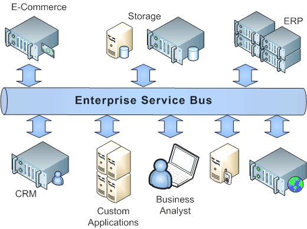

# OWT1 - Service Oriented Architecture (SOA)

Table of Contents
=================

* [OWT1 \- Service Oriented Architecture (SOA)](#owt1---service-oriented-architecture-soa)
  * [Service Oriented Architecture (SOA) Definition](#service-oriented-architecture-soa-definition)
  * [Service Definition](#service-definition)
  * [General SOA Principles](#general-soa-principles)
  * [SOA Benefits](#soa-benefits)
    * [1\. Loose Coupling](#1-loose-coupling)
    * [2\. Location Transparency](#2-location-transparency)
    * [3\. Higher Reusability](#3-higher-reusability)
    * [4\. Parallel Development](#4-parallel-development)
    * [5\. Improved Testability](#5-improved-testability)
    * [6\. Higher Scalability &amp; Availability](#6-higher-scalability--availability)
  * [SOA Technological Approaches](#soa-technological-approaches)
    * [1\. The Enterprise Service Bus (ESB)](#1-the-enterprise-service-bus-esb)
    * [2\. Business Process Management](#2-business-process-management)
    * [3\. OSGi framework](#3-osgi-framework)
    * [4\. Microservices \- a specialization of SOA](#4-microservices---a-specialization-of-soa)
    * [5\. Web APIs: REST/SOAP](#5-web-apis-restsoap)
  * [SOA Design Patterns](#soa-design-patterns)
    * [1\. Agnostic Services](#1-agnostic-services)
    * [2\. Atomic Service Transaction](#2-atomic-service-transaction)
    * [3\. Service Façade](#3-service-fa%C3%A7ade)
    * [4\. Service Callback](#4-service-callback)
    * [5\. Multiple Service Contracts](#5-multiple-service-contracts)
    * [6\. Authentication Broker](#6-authentication-broker)
    * [7\. Message Origin Authentication](#7-message-origin-authentication)
  * [SOA Best Practices](#soa-best-practices)
    * [1\. Automated Service Integration Test Suites](#1-automated-service-integration-test-suites)
    * [2\. Service Testing Framework](#2-service-testing-framework)
    * [3\. Managing Security Setup And Validation](#3-managing-security-setup-and-validation)
    * [4\. Configurable Logging](#4-configurable-logging)
    * [5\. Test Driven Development (TDD)](#5-test-driven-development-tdd)
    * [6\. Standards Adherence](#6-standards-adherence)
    * [7\. Interoperability](#7-interoperability)
    * [8\. New Technology Adoption](#8-new-technology-adoption)

## Service Oriented Architecture (SOA) Definition
The following is one of the many definitions of _Service Oriented Architecture_:

> _Service Oriented Architecture (SOA)_ is an approach used to create an architecture based upon the use of services. Services carry out some small function, such as producing data, validating a customer, or providing simple analytics. The basic principles of service-oriented architecture are independent of vendors, products and technologies. A service is a discrete unit of functionality that can be accessed remotely and acted upon and updated independently.

In October 2009, the "SOA Manifesto Working Group" came up with six core values that were included in the [SOA Manifesto](www.soa-manifesto.org):

> 1. Business value is given more importance than technical strategy.
> 2. Strategic goals are given more importance than project-specific benefits.
> 3. Intrinsic inter-operability is given more importance than custom integration.
> 4. Shared services are given more importance than specific-purpose implementations.
> 5. Flexibility is given more importance than optimization.
> 6. Evolutionary refinement is given more importance than pursuit of initial perfection.

## Service Definition
The _Service_ is the essential element of SOA. Its concept is not purely technical and has been used across many industries. In a broad definition, a _Service_ is:

> When a person or a company as the **service provider**, is offering to do something – carry goods and messages, look after vehicles, install and repair building roofs – that will benefit other people or companies, as the **service consumers**. The providers offer to contract with the consumers to do these things, in order that the consumers know in advance what they purchase.

When this concept was applied to software, the _Software Service_ was born:

> In the context of software architecture, service-orientation and service-oriented architecture, the term service refers to a software functionality or a set of software functionalities (such as the retrieval of specified information or the execution of a set of operations) with a purpose that can be reused by different clients for different purposes, together with the policies that should control its usage (based on the identity of the client requesting the service, for example).

[OASIS](https://www.oasis-open.org/) defines the _Service_ as:

> A mechanism to enable access to one or more capabilities, where the access is provided using a prescribed interface and is exercised consistent with constraints and policies as specified by the service description." [OASIS Reference Model for Service Oriented Architecture 1.0](https://www.oasis-open.org/committees/tc_home.php?wg_abbrev=soa-rm)

## General SOA Principles

There are no industry standards relating to the exact composition of a service-oriented architecture, although many industry sources have published their own principles. Some of these include the following:

Principle | Description
----|---------------
Standardized service contract |Services adhere to a standard communications agreements, as defined collectively by one or more service-description documents within a given set of services.
Service reference autonomy (an aspect of loose coupling)|The relationship between services is minimized to the level that they are only aware of their existence.
Service location transparency (an aspect of loose coupling)|Services can be called from anywhere within the network that it is located no matter where it is present.
Service longevity|Services should be designed to be long lived. Where possible services should avoid forcing consumers to change if they do not require new features, if you call a service today you should be able to call the same service tomorrow.
Service abstraction|The services act as black boxes, that is their inner logic is hidden from the consumers.
Service autonomy|Services are independent and control the functionality they encapsulate, from a Design-time and a run-time perspective.
Service statelessness|Services are stateless, that is either return the requested value or give an exception hence minimizing resource use.
Service granularity|A principle to ensure services have an adequate size and scope. The functionality provided by the service to the user must be relevant.
Service normalization|Services are decomposed or consolidated (normalized) to minimize redundancy. In some, this may not be done, These are the cases where performance optimization, access, and aggregation are required.
Service composability|Services can be used to compose other services.
Service discovery|Services are supplemented with communicative meta data by which they can be effectively discovered and interpreted.
Service reusability|Logic is divided into various services, to promote reuse of code.
Service encapsulation|Many services which were not initially planned under SOA, may get encapsulated or become a part of SOA.

## SOA Benefits

The use of SOA provides certain major benefits to the implemented system:

### 1. Loose Coupling
An underlying premise in the application of SOA to information technology is the principle of loose coupling, i.e. avoiding or at least encapsulating temporal, technological and organizational constraints in the information system design. Loosely coupled systems support late/dynamic binding to other components at run-time, and can mediate the difference in the component's structure, security model, protocols, and semantics, thus abstracting volatility.

Loose coupling in SOA is how the services are implemented without impacting other services or applications. The only interaction between the application and services is through the published interfaces. This means that applications are agnostic to service implementations and only need to respect the service contract.

### 2. Location Transparency
Location transparency means that the consumer of the service doesn’t need to know where the implementation of the services resides. It could be same server or other server across the internet. Consumer calls are agnostic to service location.

### 3. Higher Reusability
Properly designed and implemented SOA applications can provide infrastructure that allows utilization of services from heterogeneous environments such as C, C++, Java, .NET, etc. This results in extending the useful life of many core legacy systems indefinitely, no matter what language they originally developed in.

### 4. Parallel Development
The seperation of services allows their implementation to take place in parallel, as there will be fewer interdependencies compared to the ones found in a monolithic design. This - in turn - results to reduced cost and higher productivity.

### 5. Improved Testability
The fact that SOA consists of independent and reusable services, means that these services can also be tested independently. This allows the tester to not have to test/debug the whole application, but only the services where it is required. Improved testability usually results to fewer defects and a higher overall level of quality.

### 6. Higher Scalability & Availability
The isolated nature of services allows easier scaling with less cost than that of a monolithic system. In a typical scenario, if a specific service is very heavy in terms of performance/resources, it can be scaled individually and improve performance, without having to scale the whole application. This - of course - also affects high availability in a similar manner.

## SOA Technological Approaches

A SOA solution does not assume a pre-defined technical stack for implementation. Different approaches can provide different benefits, but in general the ones mentioned in this section are the predominant choices of software vendors:

### 1. The Enterprise Service Bus (ESB)
An enterprise service bus (ESB) implements a communication system between mutually interacting software applications in a service-oriented architecture (SOA). As it implements a software architecture for distributed computing, it therefore also implements a special variant of the more general client-server model, wherein, in general, any application using ESB can behave as server or client in turns. ESB promotes agility and flexibility with regard to high-level protocol communication between applications. The primary goal of the high-level protocol communication is enterprise application integration (EAI) of heterogeneous and complex service or application landscapes.

There are a number of different ESB products available on the market today. Some products with wide usage are the following:
- IBM Integration Bus
- WebSphere ESB
- Oracle Enterprise Service Bus
- TIBCO BusinessWorks
- Mule ESB
- Talend ESB
- Apache Camel

Despite their differences, most ESB implementations include all or most of the following core features:

Features| Description
---|------
Location Transparency | A way of centrally configuring endpoints for messages, so that a consumer application does not require information about a message producer in order to receive messages
Transformation| The ability of the ESB to convert messages into a format that is usable by the consumer application.
Protocol Conversion| Similar to the transformation requirement, the ESB must be able to accept messages sent in all major protocols, and convert them to the format required by the end consumer.
Routing|The ability to determine the appropriate end consumer or consumers based on both pre-configured rules and dynamically created requests.
Enhancement| The ability to retrieve missing data in incoming messages, based on the existing message data, and append it to the message before delivery to its final destination.
Monitoring / Administration|The goal of ESB is to make integration a simple task.  As such, an ESB must provide an easy method of monitoring the performance of the system, the flow of messages through the ESB architecture, and a simple means of managing the system in order to deliver its proposed value to an infrastructure.
Security| ESB security involves two main components - making sure the ESB itself handles messages in a fully secure manner, and negotiating between the security assurance systems used by each of the systems that will be integrated.

### 2. Business Process Management

Business Process Management (BPM) is a natural complement to Service-Oriented Architecture (SOA), and a mechanism through which an organization can apply SOA to high-value business challenges. Both SOA and BPM can be pursued individually, but the two approaches in concert offer reciprocal benefits. This article will address the benefits of implementing BPM on top of a SOA foundation. Those benefits include a more agile, flexible, enterprise, one that can more easily proliferate across divisions and geographies, and is more resilient to changes in underlying IT systems. In addition to discussing how the complementary disciplines of BPM and SOA inherently promote radical cooperation between business and technology groups within an organization, this article will discuss how to enrich the services delivered from within a SOA.

In BPM frameworks, solutions are nearly always based on a workflow or sets of workflows. The concept is that work in a real-time business environment should not be static, rather it should progress through a series of steps (‘a process’) in time. Basing a solution on sequential activities is effective in encouraging teams to reach completion of goals within a set period. The process platform encourages progression through tasks by sending the participants reminders and indications of their completion status and due date. Because of this, teams who use these solutions tend to perform faster and accomplish goals more consistently.

Among others, BPM provides the following benefits when applied as a SOA solution:

Features| Description
---|------
Agility|Organizations are constantly faced with the need for change. Changes may become necessary as a result of new regulations, market demands or the emergence of new ways of working. One key feature of BPM is that it facilitates the design of processes that are flexible. With BPM, you get the flexibility of making changes to processes with minimal costs. Processes can easily be customized to suit the requirements of your organization.
Productivity |BPM can facilitate the automation of a lot of repetitive elements within regular workflows. Process improvements like removal of bottlenecks, introduction of parallel processing, and elimination of redundant steps can easily be achieved with BPM. This improvement will allow employees to spend more time on other activities since the main support functions would have been handled. This translates into increased productivity and reduced waste.
Efficiency & Reduced Risks|The visibility of business processes allows for concentration on inefficiencies. Because BPM gives organizations the opportunity to work more efficiently, they are able to save their resources. BPM also results in the creation of better-designed, executed and monitored processes which can help reduce the risk of fraud.
Compliance & Transparency|Organizations need to be compliant with industry regulations. BPM ensures that organizations can implement regulatory requirements quickly, thereby preventing delays in compliance and any associated fines. When you adopt BPM, you integrate compliance into the process life cycle. This also implies that organizational processes will become transparent and visible to employees.
Employee Satisfaction|BPM eliminates a lot of red tape in organizations and allows employees to focus 100% on their work since process automation cuts down on a lot of repetitive work and makes information access easier. This in turn makes for increased productivity and a happier workforce.
Customer Focus|With leaner processes and increased productivity, employees are better able to focus on the customer. There will be an increased capacity to respond more quickly to proposals, build solutions faster and customize more quickly. BPM also brings people and technology together in a way that increases customer satisfaction. With BPM, employees are able to focus on activities that deliver the right results for customers and stakeholders.
Consistency, Repeatability & Transferability |With BPMS, each task is executed the way it was planned and designed. Identical problems are addressed the same way and there is no need to reinvent the wheel, even if roles do change. Exceptional situations and responses can also be clearly defined with BPM to ensure they are handled appropriately.
Sustainability|Business Processes are continually improved to adapt to changing organizational conditions so that they can deliver the expected results. This adaptation can be achieved with BPM while maintaining control or managerial oversight.
Measurability|All processes can be measured end-to-end and compared to expected results. This helps to manage people and processes. BPM when implemented with technology, provides reporting and analytical tools for making executive decisions. With BPM, you can streamline processes and quantify how these processes are helping your organization optimize its workflows.
Technology Integration |BPMS bridges the communication gap between business users and IT, thanks to the use of standards like BPMN. With BPM, the focus is not on “applications” but on “processes”, along with the applications that support them.

### 3. OSGi framework

> _OSGi (Open Service Gateway Initiative)_ is a Java framework for developing and deploying modular software programs and libraries. Each bundle is a tightly coupled, dynamically loadable collection of classes, jars, and configuration files that explicitly declare their external dependencies.

Features| Description
----|------
The environment and framework|OSGi is often categorized as a Java framework, however, it's actually a specification, OSGi implementations cross the framework  boundary, effectively providing an ad-hoc environment that facilitates modularizing an application into smaller and more manageable pieces.
The JVM companion|Since OSGi's roots are in the embedded market, it should come as no surprise that OSGi's primary focus is on boosting the capabilities of the lowest common denominator in Java: The Java Virtual Machine. While the JVM has more than a decade of engineering behind it, for certain tasks -- such as system services and dynamic loading -- it has fallen shy of the expected curve in some vertical industries, giving way to initiatives like OSGi to fill in feature gaps.
The Java packaging bundle|Of course no environment or framework is exempt from having its own packaging model, so just as developers may have become accustomed to dealing with WAR(Web Archives) and EAR(Enterprise Archives) while working with Java EE applications, or the more general purpose JAR(Java Archives), OSGi has its own packaging model which goes by the name of a "bundle".

A quick glance at the infrastructure used in the enterprise for enabling a SOA, will reveal a mix of Java EE containers, lightweight frameworks, and other such middle-ware for this purpose. While there is nothing wrong with this infrastructure per-se, the way in which such software is deployed makes for a monolithic -- all or nothing -- approach which goes in part against the SOA tenets of nimbleness and re-usability.

Most Java applications are manageable enough in isolation. The real issues start to arise once these seemingly simple pieces are placed in production environments alongside other Java parts, or if you will, the service orientated cloud for the enterprise. The way in which enterprise Java middle-ware and the JVM work in these scenarios, is the all or nothing concept, giving way to a few obvious headaches:

- Bloated memory foot-prints: With some Java application deployments requiring a hefty 4 or 8 GB of memory -- on occasions more -- to run properly in enterprise settings, this creates a resource black-hole on the server side in proportion to the amount of applications that need to be deployed in a single server instance.
- Class/Versioning conflicts: Evolving software pieces are another predicament under these scenarios. With everything loaded under the same umbrella -- JVM and classpath -- the greater the number of applications deployed in a single server instance, the greater the possibility applications might use different staple libraries -- JAR files -- making for a sure recipe to class loading and versioning conflicts.
- Duplicate or unnecessary parts: All application owners take care of providing the necessary dependencies for proper execution, however, once applications are deployed in production environments, it can become quite difficult to determine if certain dependencies aren't already being met by some other application or if an application is actually using 100% of the dependencies intended by its creators.

OSGi has the solution to the problems listed above by providing a consise and streamlined deployment strategy that allows for effortless scaling, as well as virtually zero downtime.

 ### 4. Microservices - a specialization of SOA
>_Microservices_ is a variant of the service-oriented architecture (SOA) architectural style that structures an application as a collection of loosely coupled services. In a microservices architecture, services should be fine-grained and the protocols should be lightweight. The benefit of decomposing an application into different smaller services is that it improves modularity and makes the application easier to understand, develop and test. It also parallelizes development by enabling small autonomous teams to develop, deploy and scale their respective services independently. It also allows the architecture of an individual service to emerge through continuous refactoring. Microservices-based architectures enable continuous delivery and deployment.

Microservices Architecture Benefits:
- Software built as microservices can be broken down into multiple component services, so that each of these services can be deployed and then redeployed independently without compromising the integrity of an application. That means that microservice architecture gives developers the freedom to independently develop and deploy services.
- Better fault isolation; if one microservice fails, the others will continue to work.
- Code for different services can be written in different languages.
- Easy integration and automatic deployment; using open-source continuous integration tools such as Jenkins, etc.
- The microservice architecture enables continuous delivery.
- Easy to understand since they represent a small piece of functionality, and easy to modify for developers, thus they can help a new team member become productive quickly.
- The code is organized around business capabilities.
- Scalability and reusability, as well as efficiency. Easy to scale and integrate with third-party services.
- Components can be spread across multiple servers or even multiple data centers.
- Work very well with containers, such as Docker.
- Complement cloud activities.
- Microservices simplify security monitoring because the various parts of an app are isolated. A security problem could happen in one section without affecting other areas of the project.
- Increase the autonomy of individual development teams within an organization, as ideas can be implemented and deployed without having to coordinate with a wider IT delivery function.

### 5. Web APIs: REST/SOAP
> A Web API is a programmatic interface consisting of one or more publicly exposed endpoints to a defined request–response message system, typically expressed in JSON or XML, which is exposed via the web—most commonly by means of an HTTP-based web server.

Most commonly, Web APIs are exposed either as Simple Object Access Protocol (SOAP) or as REpresentational State Transfer (REST) based services. These services make functional building-blocks accessible over standard Internet protocols, independent of platforms and programming languages. All web-applications with decoupled functionality from the presentation of the application and moved to a web-services layer (API) are consistent with the guidelines of implementation of SOA.

Even though built on simple foundations, Web APIs provide the following benefits:
- RESTful Web APIs are accessible by virtually any HTTP client
- No configuration required on client
- Easy to test
- Extremely light-weight

## SOA Design Patterns
As is the case with every theory, the practical implementations may vary singnificantly and may have diverging degrees of success. In general, even though there is no golden-bullet solution to fit every imaginable scenario, there are some general design patterns that ensure a certain degree of performance, robustness, and security.

### 1. Agnostic Services
Agnostic services implement logic that is common to multiple business problems. Separating agnostic logic into discrete services facilitates service reuse and composability. Furthermore, agnostic services could explicitly declare that they are agnostic. This makes it clear to future designers and builders that they are designed to be reused.

### 2. Atomic Service Transaction
Services can be wrapped in atomic transactions with a rollback feature that reverses all actions and changes. Transaction management services can be implemented in the component layer and reused by multiple services.

### 3. Service Façade
A service façade sits between a service and a contract. It eliminates the tight coupling between the service and its contract. This is intended to minimize changes to the service if the contract changes. A service can have multiple service façades to support multiple contracts.

### 4. Service Callback
A service requires its consumers to call it asynchronously. If the consumer needs a response it provides a callback address. When the service reaches some milestone in processing it messages the consumer with a response. This approach frees resources and is useful when services are expected to be long running.

### 5. Multiple Service Contracts
A service may support multiple contracts concurrently. This can be done to support backward compatibility (so that when a service changes all the consumers do not have to be updated). It is also done to provide different views to the service for different purposes (thus facilitating reuse).

### 6. Authentication Broker
An authentication broker assumes responsibility for authenticating consumers. Consumers are issued a token they can use to access services.

### 7. Message Origin Authentication
Digital certificates are used to authenticate clients. This results in preventing resource waste that could occur due to processing request of untrusted parties.

## SOA Best Practices
Apart from the designed patterns described in the previous section, certain best practices can be adopted that will greatly enhance the SOA implementation.

### 1. Automated Service Integration Test Suites
To manage service quality, it is recommended that an automated suite of tests be maintained along with the service. The suite needs to be executable as needed, with little or no setup time required. It should be able to properly test the main components within each layer of the service stack.

A related governance practice is to only certify a service for use once it has been verified that its automated integration test suite exists and is being maintained

### 2. Service Testing Framework
To automate and maintain service Integration Test Suites, there are some common capabilities that must be developed and reused. These include:
- The ability to produce test harnesses in the absence of an application UI
- Generation of test messages, based on the service description (WSDL)
- Variation of inputs, using a data table
- Data set-up and tear-down scripts
- Output of test reports
- Definition of expected results
- Execution of tests against each integrated layer of the stack (usually via a unit test environment)
- Emulation of external services (mocks)
- Inspection and validation of service messages from consuming applications
- Sending multiple test messages via separate threads

Such capabilities are packaged within an Integrated Test Framework (ITF). The framework is typically made up of commercial or open-source tools in combination with customisation or tailoring to meet the specific environment needs. Rather than repeatedly implement these capabilities with each service, the ITF should be
maintained as a separate reusable asset, containing the commonly used utilities, tools and scripts.

### 3. Managing Security Setup And Validation
With service security implementations, the following factors should be taken into consideration:
- It can be difficult to debug service handshakes, when the solution is secured from end-to-end, such as with token profiles
- Negative case test scenarios are much more prevalent than positive case (such as message being recognized and processed)
- The Integration Test Suite needs to be able to invoke secure services
- Only a subset of the WS-Security specifications is interoperable across vendor and opensource framework implementations. Thus effort for potential workarounds should be allocated beforehand
- Tests with external partners or consumers should plan to include consumer-side message and parameter logging, to narrow down debugging efforts

### 4. Configurable Logging
In order to quickly identify and narrow down on problems within SOA implementations - especially when involved in complex process flows - the use of logging is recommended. The logging should be configurable to multiple levels of detail and should enable correlation of tracing information across systems, such as via the logging of accurate timestamps or header identifiers.

### 5. Test Driven Development (TDD)
Several of the practices outlined hee can be categorised as general Test Driven Development (TDD) practices. TDD recommends beginning testing early and continuously testing, such as with each system build. As the systems evolve, there is the need for different forms of test harnesses, including the ability to mock or stub out parts that are not yet ready for prime time.

Given the complexity and coordination requirements found in many SOA projects, it is not uncommon to see incremental or iterative development practices in use. Using TDD principles is recommended in order to complement such projects by allowing them to get instant test-based feedback on the latest changes.

### 6. Standards Adherence
Often while developing a new design, it is tempting to tweak the established standard just a little bit to make it fit perfectly. However, with SOA, the aim is to maintain compatibility with other standards based implementations. Tampering with a standard ends up creating a proprietary implementation, which may later cause integration problems. For example, altering a SOAP message format to augment speed requirements may result in the client being unable to understand the request altogether. Such issues may also remain dormant initially, which would mean that rectifying them at a later stage would be proportionally costlier.

### 7. Interoperability
In order to ensure that the maximum number of consumers can access the SOA service, it is important to design it in such a way that it can be interfaced from any platform and any programming language. Using a platform independent standard ensures that the users are free to choose their own implementation mechanisms. Apart from simply being friendly, this also means that the users will have to go to virtually no trouble at all to incorporate the SOA service into their existing architecture, which increases the business value of the service.

### 8. New Technology Adoption
In addition to the fairly robust core standards forming the basis of Web Services and SOA, there is also a family of rapidly developing new applications from a variety of vendors, ranging from well established corporations to "fly by night" outfits. While it is important to keep abreast of new technology and build on it where feasible, one needs to be slightly wary of new technology until it has passed rigorous testing under the scenario that it will ultimately be used in. Therefore, newer technology should typically be incorporated in the comparatively low risk areas of the architecture.

Furthermore, since SOA services are meant to be consumed, it is often the case that the end-user will be exposed to some elements of the SOA technical stack. If those elements are alien to the end-user, the chances of service adoption will drop significantly.

