# OWT-2: SOA Using OSGi and Apache Karaf

Table of Contents
=================

  * [Architecture: Monolithic vs Modular](#architecture-monolithic-vs-modular)
    * [Monolithic Architecture Disadvantages](#monolithic-architecture-disadvantages)
        * [Modular Architecture](#modular-architecture)
  * [OSGi Specification](#osgi-specification)
  * [OSGi Implementations](#osgi-implementations)
    * [Apache Felix](#apache-felix)
    * [Eclipse Equinox](#eclipse-equinox)
    * [Knopflerfish](#knopflerfish)
    * [Gemini Blueprint](#gemini-blueprint)
    * [Concierge OSGi](#concierge-osgi)
  * [OSGi Basics](#osgi-basics)
    * [OSGi Conceptual Layers](#osgi-conceptual-layers)
       * [Module Layer](#module-layer)
       * [Lifecycle Layer](#lifecycle-layer)
       * [Service Layer](#service-layer)
    * [OSGi Bundles](#osgi-bundles)
    * [Bundle Manifests](#bundle-manifests)
    * [Bundle Life-cycle](#bundle-life-cycle)
    * [Start Levels](#start-levels)
    * [High Priority Features](#high-priority-features)
    * [OSGi Services](#osgi-services)
    * [Registering Services Using Declarative Registration](#registering-services-using-declarative-registration)
    * [Registering Services Using Annotations](#registering-services-using-annotations)
  * [Apache Karaf](#apache-karaf)
    * [Karaf Installation](#karaf-installation)
    * [Karaf Logs](#karaf-logs)
    * [Karaf Features](#karaf-features)
    * [Karaf Enterprise Features](#karaf-enterprise-features)
    * [Karaf Shell](#karaf-shell)
    * [Karaf Web Console](#karaf-web-console)
  * [Deploying Bundles on Karaf](#deploying-bundles-on-karaf)
    * [Deploy a Sample Application](#deploy-a-sample-application)
    * [Bundle ID](#bundle-id)


## Architecture: Monolithic vs Modular

In software engineering, monolithic architecture describes an architectural approach in which all application components are inter-connected, inter-dependent, and combined into a single software artifact. In a tightly-coupled architecture such as this, each component and its associations must be present in order for the code to be compiled or executed.
Monolithic applications can be considered as a big container - wherein all components of the application are assembled together and packaged - which is finally deployed as a single unit on the application server.


### Monolithic Architecture Disadvantages

Monolithic services - being tightly coupled - tend to get entangled as the application evolves, making it difficult to isolate them for purposes such as independency, scaling, or maintenance. Monolithic architectures are also much harder to understand, because there might be inter-dependencies and side-effects which are not obvious at first glance of a particular service or controller.

The table below describes some obvious disadvantages of monolithic architecture:
Aspect|Disadvantage
---|---------
Agility|In a monolithic application even if a small component in an application has to be changed, the entire application needs to be repackaged and assembled together
Scalability|Having to scale the whole application, while some services may be utilized, other services are not used at all and end-up simply consuming resources
DevOps Cycle|In the case of Continuous delivery, the whole application needs to be re-distributed even for a minor change in a component, thus increasing application delivery time and decreasing frequency of deployments
Availability|It is often the case that the failure of a single component will result in a situation that the whole application will need to be re-deployed
Performance|When a single service is under heavy load, it may consume the entire application's resources, thus resulting in a considerable drop of the overall performance


### Modular Architecture
The solution to [Monolithic Architecture Disadvantages ](#monolithic-architecture-disadvantages), is neither to dismantle and replace systems or applications, nor to completely renovate them; but rather to find a way to leverage existing software investments so that overall organizational goals are effectively supported. This approach requires to:
- Eliminate hard-dependencies
- Enable quick testing and deployment of modifications
- Improve modularity
- Introduce loose coupling
- Simplify integration tasks

The modular architecture allows to accomplish these goals by making systems more responsive to business needs, simpler to develop, and easier to maintain and manage. Implementing a solution based upon modularity helps organizations plan ahead for change, rather than responding reactively.
 

## OSGi Specification

>The OSGi specification describes a modular system and a service platform for the Java programming language, which implements a complete and dynamic component model; something that does not exist in standalone Java/VM environments. In OSGi:
> - Applications or components coming in the form of bundles for deployment, can be remotely installed, started, stopped, updated, and uninstalled without requiring a reboot. 
> - Management of Java packages and classes is specified in great detail. 
> - Application life cycle management is implemented via APIs that allow for remote downloading of management policies. 
> - The service registry allows bundles to detect the addition of new services, or the removal of services, and adapt accordingly.

The detailed OSGi Specifications can be obtained from [here](http://www.osgi.org/Specifications/HomePage).


## OSGi Implementations

The OSGi standards are defined by OSGi Alliance and published in OSGi specification documents such as the Core and Compendium specifications. These specifications contain chapters each of which describe a specific OSGi standard. This section contains the most popular implementations of OSGi standards, both commercial and open source. These implementations realize specification chapter(s) from the OSGi specification documents.

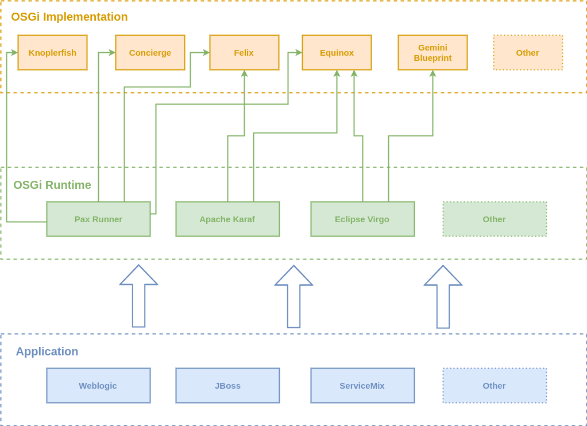


### Apache Felix


> Apache Felix is an open source implementation of the OSGi Release 5 core framework specification. The initial codebase was donated from the Oscar project at ObjectWeb. The Felix developers have made various improvements while retaining the original footprint and performance of the Oscar project. On June 21, 2007, the project graduated from incubation as a top level project and is considered the smallest size software at Apache Software Foundation.


### Eclipse Equinox


> Equinox is a sub-project of the Eclipse project that provides a certified implementation of the OSGi R4.x core framework specification. It is a module runtime that allows developers to implement an application as a set of "bundles" using the common services infrastructure.
Equinox began as a project to replace the original Eclipse plug-in runtime in version 3.0 of Eclipse (c. 2004). The open source project was seeded with code donated by IBM's Service Management Framework (SMF) product. It was further developed to meet the needs of the Eclipse community. The adaptations were made into the OSGi specification process, with many being incorporated in the R4 release of the OSGi framework specification. Since then, Equinox has been the reference implementation for the OSGi framework specification.


### Knopflerfish

Knopflerfish  OSGi Framework  (open source and enterprise editions )

The Knopflerfish R6 OSGi framework and related Services is implemented in accordance with the OSGi R6 specification. The numbering for the OSGi defined components refer to the OSGi specification chapter numbering. Version refers to the version of the particular specification in the OSGi Core Specification.

Knopflerfish Pro is Makewave’s certified release 4, version 4.2 compliant OSGi service platform, based directly on the open source Knopflerfish OSGi distribution. Knopflerfish Pro is a fully supported product, intended for professional use, and gives companies the assurance required to use open source software in commercial systems. Knopflerfish Pro extends open source Knopflerfish by adding a set of bundles only available in the Pro version, making Knopflerfish Pro a complete implementation of the OSGi Release 4, version 4.2 specifications. This includes the OSGi defined UPnP services as well as the residential and mobile management services, e.g. DMT Admin.


### Gemini Blueprint

Gemini Blueprint is Eclipse's Community implementation for the OSGi Alliance. Gemini Blueprint makes it easy to build Java applications that run in an OSGi framework. Applications benefit from using a better separation of modules, the ability to dynamically add, remove, and update modules in a running system, the ability to deploy multiple versions of a module simultaneously and a dynamic service model.


### Concierge OSGi
Concierge OSGi is Eclipse's Community OSGi implementation for mobile and embedded devices. Concierge brings OSGi to popular devices such as the Raspberry Pi and Beaglebone black. Concierge also has support for running on Android's Dalvik VM. With a .jar size of around 250kb, Concierge is the smallest OSGi R5 implementation. This results in a fast startup time and an efficient service registry. Also, the framework runs on current and upcoming Java embedded profiles (e.g. Java 8 compact profile).


Implementation|Specification Version|Link
---|--|---
Apache Felix|1.7|http://felix.apache.org
Eclipse Equinox|1.8|http://eclipse.org/equinox
Knopflerfish|1.7|http://www.knopflerfish.org	
Gemini Blueprint|1.8|https://eclipse.org/gemini/blueprint/
Concierge osgi|R5|http://www.eclipse.org/concierge/


## OSGi Basics

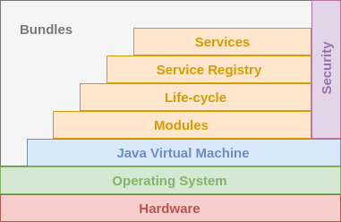


### OSGi Conceptual Layers

OSGi framework architecture consists of three conceptual layers. Each layer is dependent on the layer(s) beneath it. The sections below provide an overview of each layer.


##### Module Layer

The module layer defines the OSGi module concept, the bundle. The bundle is a JAR file with extra metadata, and contains java classes and related resources such as images, xml files, etc. Through [manifest.mf metadata file](path TBD ), the module layer declares which contained packages in a JAR file are visible to other modules, and which external packages the bundle has.


##### Lifecycle Layer

This layer defines how bundles are dynamically installed and managed in the OSGi framework. It provides a way for a bundle to gain access to the underlying OSGi framework. If OSGi was a car, the module layer would provide modules such as tire, seat, etc, and the lifecycle layer would provide the electrical wiring which makes the car run.

 ##### Service Layer

In this layer, service providers publish services to the service registry, and service clients search the registry in order to find available services to use. This is similar to the service-oriented architecture (SOA) paradigm which is largely used in web services. Here, OSGi services are local to a single VM, so it is sometimes referred-to as 'SOA in a VM'.


### OSGi Bundles

> The OSGi spec describes the OSGi Bundle as a **unit of modularization** that is comprised of Java classes and other resources which together can provide functions to end users.

 An OSGi Bundle is a JAR file that contains a manifest file describing the contents of the JAR and providing information about the bundle. It can contain optional documentation in the OSGI-OPT directory of the JAR file or one of its sub-directories. In short, **a bundle = jar + OSGI information (specified in the JAR manifest file - META-INF/MANIFEST.MF)**. This means that apart from adding a few lines in the manifest file, no extra files or predefined folder layouts are required in order to create a bundle from a jar.

An OSGi Bundle:
- Is the standard deployment unit of OSGi
- Is versioned
- Has declarative dependencies specification


#### Bundle Manifests

 In addition to the headers that can be defined for a non-OSGi JAR or WAR file, the bundle manifest file for an OSGi bundle contains OSGi-specific headers. The metadata that is specified in these headers enables the OSGi Framework to process the modular aspects of the bundle.

 A simple Manifest:
 
 
 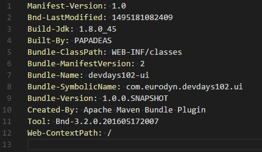


A more complex Manifest:


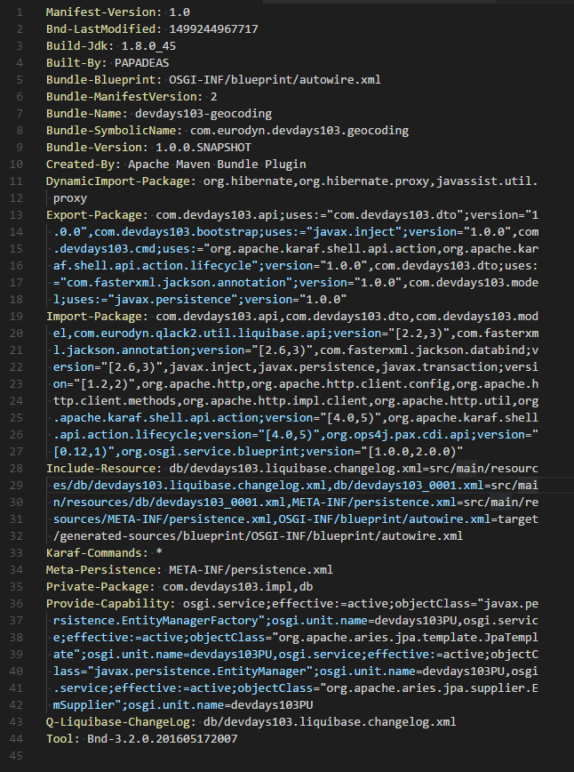


OSGi Bundles may define:
- Libraries / SDKs
- REST endpoints
- Web Applications
- Services
- Extensions for other bundles

Most IDEs provide auto-generation mechanisms for manifests but also convenient editors where developer may edit the manifest file.


### Bundle Life-cycle

OSGi is a dynamic platform. This means that bundles may be installed, started, updated, stopped, and uninstalled at any time during the running of the framework.

OSGi Bundle Status|Description
----------|----------
INSTALLED|The bundle has been installed into the OSGi container, but some of the bundle's dependencies have not yet been met. The bundle requires packages that have not been exported by any currently installed bundle.
RESOLVED|The bundle is installed, and the OSGi system has connected up all the dependencies at a class level and made sure they are all resolved. The bundle is ready to be started. If a bundle is started and all of the bundle's dependencies are met, the bundle skips this state.
STARTING|A temporary state that the bundle goes through while the bundle is starting, after all dependencies have been resolved.
ACTIVE|The bundle is running.
STOPPING|A temporary state that the bundle goes through while the bundle is stopping.
UNINSTALLED|The bundle has been removed from the OSGi container.


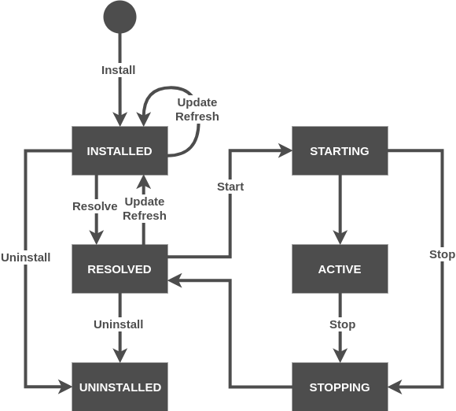


### Start Levels

A priority number can be assigned to each bundle, and that is called start level.The framework itself also has a certain start level, and only bundles with a start level lower than or equal to that of the framework will actually be active. Although bundles with a start level higher than that of the framework will not be active, it is possible to activate them as soon as the framework reaches this start level. That is usually described as "persistently started". Once the framework starts up, it will go through the start levels one by one until it reaches the target start level. This procedure is usually described as "persistently started" and it is used to determine their startup order -by assigning start levels to the bundles-.


There are however a couple of things to keep in mind:

- The start level service is optional and when it’s not present there is no control over the startup order.
- If multiple bundles share the same start level, there is no guarantee in what order they will start, neither the order they will finish activating.
- There must be no dependency on the presence of a service that was published by a bundle with a lower start level, since Services are dynamic.
- When a bundle is updated, its services are ``resolved`` for a short while.


There are two testing modes for start levels:

- Diagnostics mode: When there is a problem that needs further analysis, the management agent can set a start level higher than the usual, which will activate extra bundles with monitoring or debugging functionality.

- Power-save mode: For embedded applications, a special power save start level could disable all bundles that are not necessary in that mode.


#### High Priority Features

There are some bundles that should be started early in the startup process, such as a logging service, or a splash screen. That is accomplished by setting such bundles a low start level.


### OSGi Services

> An OSGi service is a java object instance, registered into an OSGi framework with a set of properties. Any java object can be registered as a service, but typically it implements a well-known interface.

The first step of the definition of an OSGi service is the declaration of the class or interface to the corresponding service. This is called the service interface. The second step is the creation of the implementation class for the service interface. OSGi provides a central service registry which allows developers to register services implementations and consume existing services via the OSGi runtime. A service can be dynamically started and stopped, and plug-ins which use services must be able to handle this dynamic behavior. The plug-ins can register listeners to be informed if a service is started or stopped. During the declaration of a service it is possible to specify key / values which can be used to configure the service. It is possible to define a [Start level](/openwis-pilots-tutorial-2#start-levels) for a service via a service property.

An OSGi Service:
- Provides a contract and one (ore more) implementations of that contract.
- Can be deployed, undeployed, updated, in real-time.
- Allows dynamic binding
- Allows LDAP-like querying capabilities
- Provides SOA paradigm implementation
- Follows Publish-Find-Subscribe pattern
- Is kept in a Service Registry by OSGi
- Promotes interface-driven development
- Provides a contract between Producer and Consumer
 

### Registering Services Using Declarative Registration

For declarative registration, quite a few frameworks/tools are available, the most popular of which are DS, iPOJO, and Blueprint. This section will focus on Blueprint.

> The Blueprint Container specification defines a dependency injection framework for OSGi. It is designed to deal with the dynamic nature of OSGi, where services can become available and unavailable at any time. The specification is also designed to work with plain old Java objects (POJOs) so that the same objects can be used within and outside the OSGi framework. The Blueprint XML files that define and describe the various components of an application are key to the Blueprint programming model. The specification describes how the components get instantiated and wired together to form a running application.
OSGi blueprint


```
<?xml version="1.0" encoding="UTF-8"?>
<blueprint xmlns=”http://www.osgi.org/xmlns/blueprint/v1.0.0”>
    ...
</blueprint>
```

### Registering Services Using Annotations
 
To register services using annotation the usage of `blueprint-maven-plugin` is required.

A service registration with annotations example:
```
import org.ops4j.pax.cdi.api.OsgiServiceProvider;
import javax.inject.Singleton;

@Singleton
@OsgiServiceProvider(classes = {AService.class})
public class AServiceImpl implements AService {
...   
```


# Apache Karaf

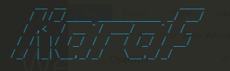

 
>Apache Karaf is a modern and polymorphic container. Karaf can be used standalone as a container, supporting a wide range of applications and technologies. It also supports the "run anywhere" (on any machine with Java, cloud, docker images, …​) using the embedded mode. It’s a lightweight, powerful, and enterprise ready platform. With this flexibility, Karaf is the perfect solution for microservices, systems integration, big data, and much more.
Apache Karaf uses either the Apache Felix or Eclipse Equinox OSGi frameworks - providing additional features on top of the framework - and can be scaled from a very lightweight container to a fully featured enterprise service.

### Karaf Installation

(Windows)

Download the Binary Distribution zip from [Karaf official page](http://karaf.apache.org/download.html)

Select a folder and extract it, that folder will be the Karaf-home, in this turorial we use `D:\apache-karaf-4.0.9\bin`


Then open a cmd client and navigate to the {karaf home}\bin path and execute:

    cd D:\apache-karaf-4.0.9\bin
    karaf.bat

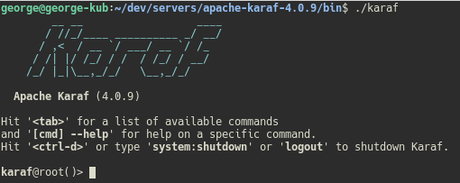

To exit Apache Karaf console:

    Ctrl + D

### Karaf Logs

To acces the Karaf logs, from a shell in the Karaf home folder:

    tail -F data\log\karaf.log

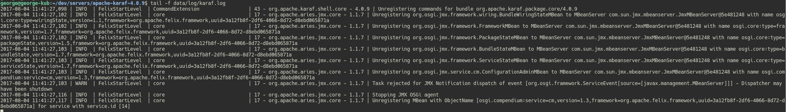

### Karaf Features
Apache Karaf supports the provisioning of applications and modules using the concept of Karaf Features. When a feature is being installed, Apache Karaf installs all resources described in the feature. This means that it will automatically resolve and install all bundles, configurations, and dependent features described in that feature.

A feature describes an application as:
- A name
- A version
- An optional description (eventually with a long description)
- A set of bundles
- Optionally a set configurations or configuration files
- Optionally a set of dependency features


### Karaf Enterprise Features
  Karaf, as is delivered, has more features than the vanilla OSGi environment. In the Enterprise version, there are even more provided out-of-the-box:   

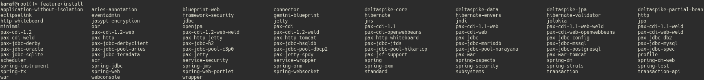


### Karaf Shell

Karaf Shell is the default interface when Karaf boots up. It is a text-based administration console, which can also be used for debugging and view logs. Moreover, it allows us to connect to a background-running, local Karaf instance via:

    /bin/client

### Karaf Web Console

Apache Karaf provides an optional WebConsole. This WebConsole provides a graphical web GUI to see and manage your Apache Karaf container.

You can use the WebConsole to:
- Manage Apache Karaf features
- Manage OSGi bundles
- Manage the instances
- Manage the configurations
- Manage the log service


Installation of WebConsole
To enable the Apache Karaf WebConsole, you just have to install the `webconsole feature`:


    karaf@root()> feature:install webconsole


Navigate to [default webconsole page](http://localhost:8181/system/console/bundles)

Authentication is required. The default username / password is :
       
       karaf / karaf

Optionally it can be modified  at:

    {KARAF_HOME}\etc\users.properties
   


After the successful log in:

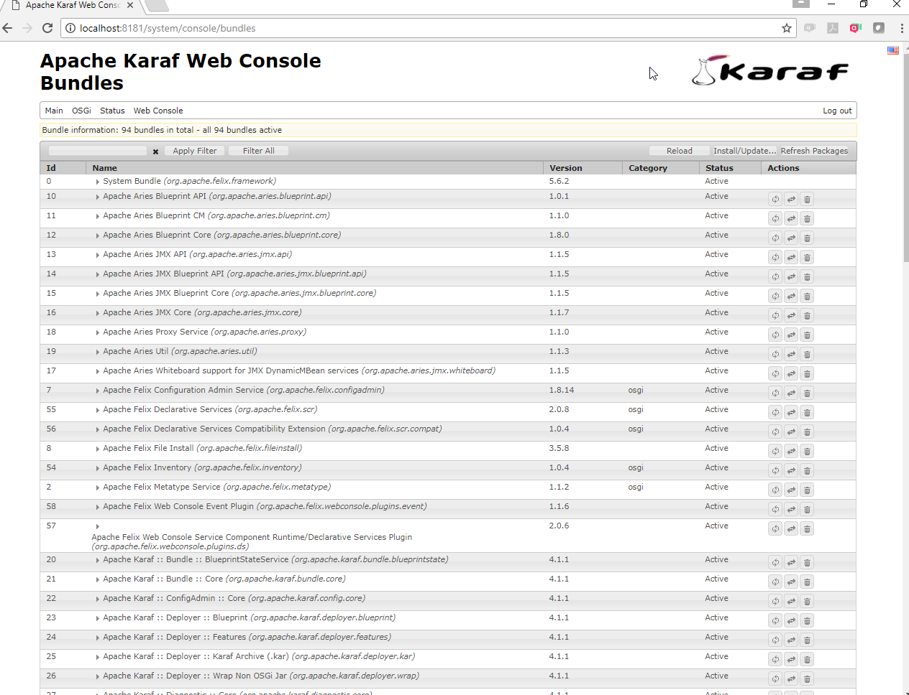


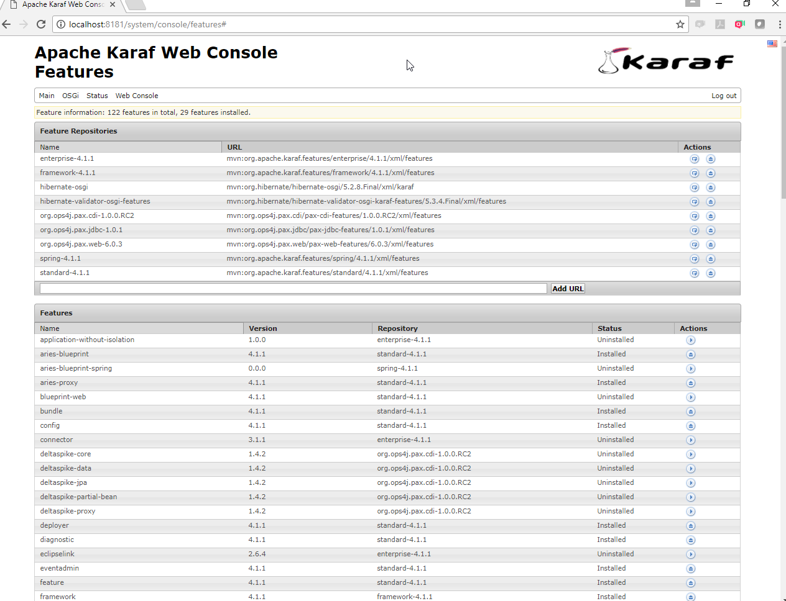


## Deploying Bundles on Karaf

### Deploy a Sample Application
The Karaf user guide provides extensive  information on how to fully leverage its functionality. This section will focus on installing a sample application:


Build the code as instructed [here](/code/README.md).

Install the bundle:

    bundle:install -s mvn:com.owt2.demo/bundle-demo/1.0.0-SNAPSHOT

### Bundle ID

After installation installation, Karaf assigns a Bundle ID to each Bundle. In our case, Bundle ID: 97

Bundle ID can be used as a reference to the specified Bundle ex:

    bundle:update 97


All available Bunldes are listed with `list` command:


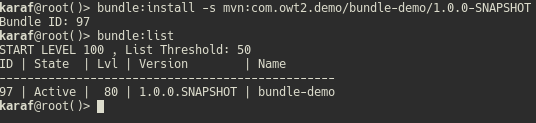


