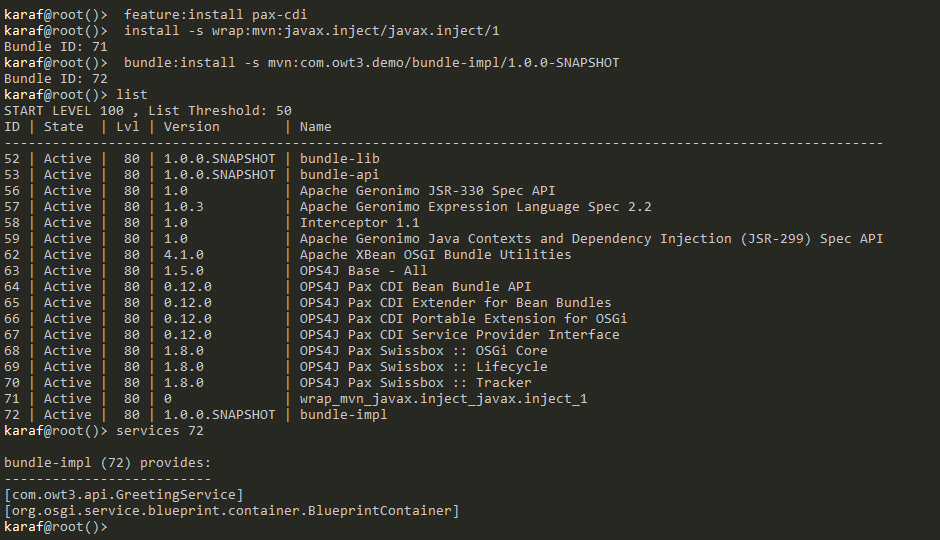

# OWT-3: Creating OSGi Services in Karaf

Table of Contents
=================

* [OWT\-3: Creating OSGi Services in Karaf](#owt-3-creating-osgi-services-in-karaf)
  * [1\. General Notes](#1-general-notes)
  * [2\. Maven module: bundle\-parent](#2-maven-module-bundle-parent)
      * [Artifact Information](#artifact-information)
      * [Children Modules](#children-modules)
      * [Build Properties](#build-properties)
      * [Plugin Management](#plugin-management)
  * [3\. Maven module: bundle\-lib](#3-maven-module-bundle-lib)
      * [Package as Bundle](#package-as-bundle)
      * [Generate Manifest](#generate-manifest)
  * [4\. Maven module: bundle\-api](#4-maven-module-bundle-api)
  * [5\. Maven module: bundle\-impl](#5-maven-module-bundle-impl)
    * [Blueprint](#blueprint)
    * [Adding Blueprint](#adding-blueprint)
      * [Maven Blueprint Plugin](#maven-blueprint-plugin)
      * [Blueprint Plugin Dependencies](#blueprint-plugin-dependencies)
  * [6\. Maven module: bundle\-demo](#6-maven-module-bundle-demo)
      * [Singleton Declaration](#singleton-declaration)
      * [OSGi Service Injection](#osgi-service-injection)
      * [Code Execution](#code-execution)
  * [7\. Installing the Bundles on Karaf](#7-installing-the-bundles-on-karaf)
    * [Installing: bundle\-lib](#installing-bundle-lib)
    * [Installing: bundle\-api](#installing-bundle-api)
    * [Installing: bundle\-impl](#installing-bundle-impl)
    * [Installing: bundle\-demo](#installing-bundle-demo)


## 1. General Notes

This tutorial will examine the available ways of registering OSGi services (e.g. xml, annotation, etc.) and will provide a hands-on code example of OSGi services.

More specifically, it will:
1. Create two bundles.
2. Create two services, one in each bundle.
3. Wire the services together so that communication achieved.

> The code for this tutorial is available in the _code_ directory. It is recommended to have it checked-out locally and refer to it while going through the tutorial.

> All the maven modules detailed below have the standard maven directory structure.

## 2. Maven module: bundle-parent

The `bundle-parent` maven module serves as the _parent_ maven project for building. It is responsible to build all of its _children_ modules, and may optionally provide dependency and plugin management. In our code it contains a single file, the maven build descriptor, `pom.xml`. The following are the points of interest in our pom.xml file:

> #### Artifact Information
> This information is used to uniquely identify the artifact.
> 
> ```xml
> <groupId>com.owt3.demo</groupId>
> <artifactId>parent</artifactId>
> <version>1.0.0-SNAPSHOT</version>
> <packaging>pom</packaging>
> ```

> #### Children Modules
> These _children_ modules will be built by the parent. Each child module must contain a reference to the parent in its own pom.xml file.
>
> ```xml
> <modules>
>   <module>../bundle-lib</module>
>   <module>../bundle-api</module>
>   ...
> </modules>
> ```

> #### Build Properties
> These properties serve as variables and may be used by both the parent and children modules. They are employed in order to centrally manage information.
>
> ```xml
> <properties>
>   <maven-bundle-plugin.version>3.2.0</maven-bundle-plugin.version>
>   <blueprint-maven-plugin.version>1.5.0</blueprint-maven-plugin.version>
>   ...
> </properties>
> ```

> #### Plugin Management
> This section defines plugins that may be used by both the parent and children modules.
>
> ```xml
> <pluginManagement>
>   <plugins>
>     <plugin>
>     ...
>     </plugin>
>   </plugins>
> </pluginManagement>
> ```

## 3. Maven module: bundle-lib
This is a helper bundle which contains a single source file _(DemoUtil.java)_ with a simple method that capitalizes a given string, as seen in the snippet below:

```java
  public String upperCaseIt(String text) {
    return text.toUpperCase();
  }
```

In order to build this artifact and make it "OSGi-ready", all we need is a _Manifest_ file, as explained [here](/OWT-2#bundle-manifests) 

To create a manifest file automatically we can use the `maven-bundle-plugin`. It is a highly configurable plugin, allowing developers to auto-generate very complex manifest files. In essence, it is a wrapper of the [BND tool](http://bndtools.org/), a class analysis tool which analyses the generated jar and creates the manifest file.

To achieve all of the above we have to do the following in the module's pom.xml file:


> #### Package as Bundle
> This xml line makes maven understand that it will be generating an OSGi bundle.
>
> ```xml
> <packaging>bundle</packaging>
> ```

> #### Generate Manifest
> The maven-bundle-plugin declaration that will generate the manifest file.
>
> ```xml
> <plugin>
>   <groupId>org.apache.felix</groupId>
>   <artifactId>maven-bundle-plugin</artifactId>
>   <version>${maven-bundle-plugin.version}</version>
>   <extensions>true</extensions>
> </plugin>
> ```

Once the module is built successfully, the generated manifest can be found at: _code/bundle-lib/target/classes/META-INF/MANIFEST.MF_

The generated manifest for bundle-lib should look like this:


## 4. Maven module: bundle-api
This bundle contains the Service API, where the service specification resides. In essence, it contains the interface that some other bundle will need to implement, as can be seen in the snippet below:


```java
public interface GreetingService {
    String greet(String name);
}
```
Its `pom.xml` file is very similar to the one of the `bundle-lib` module, and it simply generates an OSGi bundle with a manifest.


## 5. Maven module: bundle-impl
This bundle contains the implementation of the interface defined in `bundle-api`. When built, it will create the actual OSGi service that will be deployed on Karaf.

As discussed in [OWT2 OSGi Services](/OWT-2#osgi-services), there are two ways to declare a service:

- Programmatically via BundleActivator
- Via a variety of available frameworks/tools:
  - [OSGi Declerative Services (PDE format)](https://github.com/fipro78/osgi-ds-getting-started-pde)  
  - [OSGi Declerative Services (Bndtools format)](https://github.com/fipro78/osgi-ds-getting-started-bndtools) (See also: [Bndtools tutorial](http://bndtools.org/tutorial.html)  )
  - [OSGi iPOJO](http://felix.apache.org/documentation/subprojects/apache-felix-ipojo.html)  
  - [Blueprint](http://aries.apache.org/modules/blueprint.html)
  
  
In this tutorial we will use [Blueprint](http://aries.apache.org/modules/blueprint.html), because of its popularity and lack of complexity.

### Blueprint

Blueprint is an [Apache Aries project](http://aries.apache.org/) module, which provides a dependency injection framework for OSGi and was standardized by the OSGi Alliance in OSGi Compendium R4.2. It is designed to deal with the dynamic nature of OSGi, where services can become available and unavailable at any time. The specification is also designed to work with plain old Java objects (POJOs) enabling simple components to be written and unit tested in a JSE environment without needing to be aware of how they are assembled. The Blueprint XML files that define and describe the assembly of various components are key to the Blueprint programming model. The specification describes how the components get instantiated and wired together to form a running module.


### Adding Blueprint
Instead of manually tracking services with code, in Blueprint services are simply defined in an XML file such as the one below:

```xml
<?xml version="1.0" encoding="UTF-8" standalone="no"?>
<blueprint xmlns="http://www.osgi.org/xmlns/blueprint/v1.0.0">
  <bean id="AServiceImpl" class="com.sample.impl.AServiceImpl"/>
  <service id="AService" interface="com.sample.api.AServiceImpl" ref="AServiceImpl"/>
</blueprint>
```

This may appear simple enough, but in most real-world applications there are many services, making maintenance of huge blueprint.xml files inefficient. Luckily, Blueprint xml generation can also be fully-automated via use of a maven plugin and annotations.

As a result, in the module's pom.xml file we must add the following:

> #### Maven Blueprint Plugin
> 
> ```xml
> <plugin>
>   <groupId>org.apache.aries.blueprint</groupId>
>   <artifactId>blueprint-maven-plugin</artifactId>
>   <version>${blueprint-maven-plugin.version}</version>
>   <configuration>
>     <scanPaths>
> 	    <scanPath>com.owt3.impl</scanPath>
> 	  </scanPaths>
>   </configuration>
>   <executions>
>     <execution>
> 	    <goals>
> 	      <goal>blueprint-generate</goal>
> 	    </goals>
> 	    <phase>process-classes</phase>
> 	  </execution>
>   </executions>
> </plugin>
> ```

> #### Blueprint Plugin Dependencies
> 
> ```xml
> <dependency>
>   <groupId>javax.inject</groupId>
>   <artifactId>javax.inject</artifactId>
>   <version>${javax.inject.version}</version>
> </dependency>
> <dependency>
>   <groupId>org.ops4j.pax.cdi</groupId>
>   <artifactId>pax-cdi-api</artifactId>
>   <version>${pax.cdi.version}</version>
> </dependency>
> ```

The Blueprint plugin will scan the classes of _com.owt3.impl_ path for specific annotations. These annotations will then instruct it on how to generate the xml file required. Also, as can be seen in the above snippets, some properties defined in the `bundle-parent` project are now utilized, such as `${javax.inject.version}` and `${pax.cdi.version}`.

The aforementioned annotation that assists in the Blueprint xml generation _(@OsgiServiceProvider)_ can be seen below:

```java
import org.ops4j.pax.cdi.api.OsgiServiceProvider;
import javax.inject.Singleton;

@Singleton
@OsgiServiceProvider(classes = {GreetingService.class})
public class GreetingServiceImpl implements GreetingService {

//...
```

Once the module is successfully built, the Blueprint xml file can be found here: _code/bundle-impl/target/generated-sources/blueprint/OSGI-INF/blueprint/autowire.xml_


Once the module is built successfully, the generated manifest can be found at: code/bundle-impl/target/classes/META-INF/MANIFEST.MF

The generated manifest for bundle-impl should look like this:


## 6. Maven module: bundle-demo
This bundle is the one that will actually demonstrate the setup we created earlier. It creates a Singleton bean that - once deployed - will call the _GreetingService_ implementation defined above, which will in turn use the `bundle-lib` module to capitalize the provided string input.

In terms of the `pom.xml` configuration, it is similar to `bundle-impl` and it will auto-generate the required Blueprint xml file. In terms of code, the following are the main points of interest in `BundleDemo.java`:


> #### Singleton Declaration
> This will create a Singleton (single-instance) bean, and deploy it on Karaf.
> 
> ```java
> @Singleton
> public class BundleDemo {
> ```

> #### OSGi Service Injection
> This will inject the implementation of the GreetingService into the demo class.
> 
> ```java
> @OsgiService
> @Inject
> private GreetingService greetingService;
> ```

> #### Code Execution
> The code within _init()_ will be executed after the service bean has been successfully deployed.
> 
> ```java
> @PostConstruct
> public void init() {
>   ...   
> }
> ```

## 7. Installing the Bundles on Karaf
Each of the bundles mentioned above - with the exception of bundle-parent - must be installed on Karaf.

In general, the command to install a bundle on Karaf is the following:
```
bundle:install -s mvn:<GROUP_ID>/<ARTIFACT_ID>/<VERSION>
```

The GROUP_ID, ARTIFACT_ID, and VERSION are the ones specified in the `pom.xml` file of each respective module. What Karaf actually does is simply request the specified artifact from maven, and install it.

### Installing: bundle-lib
Execute the following on the Karaf command-line:
```
bundle:install -s mvn:com.owt3.demo/bundle-lib/1.0.0-SNAPSHOT
```


### Installing: bundle-api
Execute the following on the Karaf command-line:
```
bundle:install -s mvn:com.owt3.demo/bundle-api/1.0.0-SNAPSHOT
```


### Installing: bundle-impl
The following external dependencies need to be installed before our `bundle-impl`. This only needs to happen once in our Karaf installation. From then on, they are available for every other bundle that requires them:
- pax-cdi (Karaf feature)
- javax.inject (External library)

The above is achieved as follows:
```
 feature:install pax-cdi 
 
 install -s wrap:mvn:javax.inject/javax.inject/1
 ```

Now the OSGi bundle can be installed using:
```
bundle:install -s mvn:com.owt3.demo/bundle-impl/1.0.0-SNAPSHOT
```

By typing `services <BUNDLE_ID>` in the Karaf command-line we can see what our newly installed bundle provides:




### Installing: bundle-demo
Execute the following on the Karaf command-line:
```
bundle:install -s mvn:com.owt3.demo/bundle-demo/1.0.0-SNAPSHOT
```

And here is the output of the demo bundle execution:


