# OWT-4: Exposing a Service via REST in Karaf Using CXF

Table of Contents
=================

* [OWT\-4: Exposing a Service via REST in Karaf Using CXF](#owt-4-exposing-a-service-via-rest-in-karaf-using-cxf)
* [Table of Contents](#table-of-contents)
  * [1\. General Notes](#1-general-notes)
      * [Cleaning Karaf](#cleaning-karaf)
  * [2\. Maven module: bundle\-parent](#2-maven-module-bundle-parent)
  * [3\. Maven module: bundle\-lib](#3-maven-module-bundle-lib)
  * [4\. Maven module: bundle\-api](#4-maven-module-bundle-api)
      * [JSON](#json)
  * [3\. Maven module: bundle\-rest](#3-maven-module-bundle-rest)
      * [REST](#rest)
      * [Apache CXF](#apache-cxf)
    * [Apache CXF maven dependency](#apache-cxf-maven-dependency)
    * [The REST Service](#the-rest-service)
      * [Injecting OSGi Service](#injecting-osgi-service-1)
      * [Defining REST Endpoints](#defining-rest-endpoints)
      * [HTTP GET Endpoint](#http-get-endpoint)
      * [HTTP Status Code](#http-status-code)
    * [Configuring CXF in Blueprint](#configuring-cxf-in-blueprint)
      * [CXF Configuration](#cxf-configuration)
  * [5\. Installing the Bundles on Karaf](#5-installing-the-bundles-on-karaf)
      * [Installing Apache CXF and its Dependencies](#installing-apache-cxf-and-its-dependencies)
    * [Installing: bundle\-lib](#installing-bundle-lib)
    * [Installing: bundle\-api](#installing-bundle-api)
    * [Installing: bundle\-impl](#installing-bundle-impl)
    * [Installing: bundle\-rest](#installing-bundle-rest)
  * [6\. Testing With SoapUI](#6-testing-with-soapui)
      * [SoapUI](#soapui)
    * [REST Project Creation](#rest-project-creation)
    * [Testing REST Services](#testing-rest-services)
      * [Testing: HTTP GET "greeter" Endpoint](#testing-http-get-greeter-endpoint)
      * [Testing: HTTP POST "greeter" Endpoint](#testing-http-post-greeter-endpoint)
      * [Testing: HTTP GET "aNotAllowedMethod" Endpoint](#testing-http-get-anotallowedmethod-endpoint)


## 1. General Notes
This tutorial will integrate CXF into OWT-3 and demonstrate how to utilize it in order to create a REST service with a number of endpoints. The created service will contain 3 methods that will allow a client to:

- Perform a GET request, and receive a JSON response.
- Perform a POST request, and receive a JSON response.
- Perform a GET request, and receive a response with a custom HTTP status code.

> The code for this tutorial is available in the _code_ directory. It is recommended to have it checked-out locally and refer to it while going through the tutorial.

> All the maven modules detailed below have the standard maven directory structure.

> The code of this tutorial builds on the base provided by OWT-3. As a result, only new concepts/features will be explained here.

> #### Cleaning Karaf
> In order to avoid dependency conflicts and other configuration errors, we will make sure that Karaf is clean and unnecessary bundles are removed. _(Please note that this is not mandatory, but it is considered a good practice)_.
> 
> This is achieved by starting Karaf the following way:
> ```
> karaf.bat clean
> ```

## 2. Maven module: bundle-parent
As in OWT-3, the `bundle-parent` maven module serves as the _parent_ maven project for building the application/service. 

## 3. Maven module: bundle-lib
Library bundle. No changes from OWT-3.

## 4. Maven module: bundle-api
As in OWT-3, the `bundle-api` maven module provides the Service API, where the service specification resides. However, in this tutorial it will also provide the "message contract" for the communication of client and server. This communication will be performed in JSON format.

> #### JSON
>
>[JSON](http://www.json.org/) is an open-standard file format that uses human-readable text to transmit data objects consisting of attribute–value pairs and array data types (or any other serializable value). It is a very common data format used for asynchronous browser/server communication, and as a replacement for XML in some AJAX-style systems.

In order to ensure that the JSON response of the service is structured correctly, we employ a _Data Transfer Object_ (DTO). A DTO is an object that carries data between processes. The motivation for its use is that communication between processes is usually done resorting to remote interfaces (e.g. web services), where each call is an expensive operation. Because the majority of the cost of each call is related to the round-trip time between the client and the server, one way of reducing the number of calls is to use an object (the DTO) that aggregates the data that would have been transferred by the several calls, into a single request.

In Java, DTOs are usually simple objects with private fields and accessor methods (getters & setters) for each field. They are commonly serialized and deserialized on-the-fly by the framework/library that provides the web services, and their most common serialization formats are XML and JSON. For our service, we have created a DTO that will simply carry a response message to the caller, in the _com.owt4.api.dto.ResponseDTO.java_ file.

## 3. Maven module: bundle-rest
The `bundle-rest` maven module hosts the REST service. The service endpoints utilize the OSGi services which are declared in `bundle-api` and implemented in `bundle-impl`.

> #### REST
> 
> Representational State Transfer (REST) is an architectural style that specifies constraints, such as the uniform interface, that if applied to a web service induce desirable properties, such as performance, scalability, and modifiability, that enable services to work best on the Web. In the REST architectural style, data and functionality are considered resources and are accessed using Uniform Resource Identifiers (URIs), typically links on the Web. The resources are acted upon by using a set of simple, well-defined operations. The REST architectural style constrains an architecture to a client/server architecture and is designed to use a stateless communication protocol, typically HTTP. In the REST architecture style, clients and servers exchange representations of resources by using a standardized interface and protocol.

In order to create and deploy REST service itself, Apache CXF is used. CXF is a first-class feature available in Karaf, which also integrates easily with Blueprint.

> #### Apache CXF
>
> [Apache CXF](http://cxf.apache.org/) is an open source service framework that allows developers to build services using frontend programming APIs, like JAX-WS and JAX-RS. These services can speak a variety of protocols such as SOAP, XML/HTTP, RESTful HTTP, or CORBA and work over a variety of transports such as HTTP, JMS or JBI. 


### Apache CXF maven dependency
To make Apache CXF available to our Java source code, the following dependency is added to the module's pom.xml file _(Please note that the `javax.ws.rs-api.version` property is defined in the bundle-parent module pom.xml)_. 

```xml
        <dependency>
            <groupId>javax.ws.rs</groupId>
            <artifactId>javax.ws.rs-api</artifactId>
            <version>${javax.ws.rs-api.version}</version>
        </dependency>
```

### The REST Service
The Java class _com.owt4.rest.GreeterResource_ defines the REST service. The endpoints will be declared herein, and the OSGi services will be used inside those methods. 

> #### Injecting OSGi Service
> The `@Inject` and `@OsgiService` annotations are combined to inject the GreetingService OSGi service into the REST service class.
>
> ```java
> public class GreeterResource {
>
> @Inject
> @OsgiService
> private GreetingService greetingService;
>```

> #### Defining REST Endpoints
> The `@POST` annotation specifies that this endpoint may only be called using `HTTP POST`.  
> The `@Path` defines the relative path of this endpoint.  
> The `@Produces` is the content type of the endpoint's response, and the `@Consumes` the content type of the incoming request.  
> The `@QueryParam` specifies the name of a query parameter. It is mostly used in `GET` requests, but in CXF when coupled with `@Consumes("application/x-www-form-urlencoded")`, it is used to specify the name of a parameter in the  `BODY` of the `POST` request.
>
> ```java
> @POST
> @Path("/greeter")
> @Produces(MediaType.APPLICATION_JSON)
> @Consumes("application/x-www-form-urlencoded")
> public ResponseDTO greetPost(@QueryParam("name") String name) {
>   ... 
> }
>```

> #### HTTP GET Endpoint
> Similarly with @POST, the `@GET` annotation specifies that this endpoint may only be called using `HTTP GET`.  
> In this scenario, the request parameters are transmitted in the request URL, so the `@Consumes` annotation has no actual value. Thus it is not included.  
> Furthermore, it is easy to notice that this `GET` endpoint has the same `@Path` as the `POST` one. This is something allowed, as long as the HTTP verb is not the same.
>
> ```java
> @GET
> @Path("/greeter")
> @Produces(MediaType.APPLICATION_JSON)
> public ResponseDTO greetPost(@QueryParam("name") String name) {
>   ... 
> }
>```

> #### HTTP Status Code
> A service endpoint normally returns a 200 HTTP status code. However, any code may be returned, as in this case where a `Status.METHOD_NOT_ALLOWED (405)` code is returned.
>
> ```java
> @GET
> @Path("/aNotAllowedMethod")
> @Produces(MediaType.APPLICATION_JSON)
> public Response retrieveSomething() {
>   return Response.status(Status.METHOD_NOT_ALLOWED.getStatusCode()).build();
> }
>```

### Configuring CXF in Blueprint
Some extra configuration is required in order to be able to deploy the REST service on Karaf. This configuration is specified in the _{module home}/src/main/resources/OSGI-INF/blueprint/blueprint-cxf.xml_ file.

> #### CXF Configuration
> In this snippet we configure some global attributes of the CXF REST instance.
> The `jaxrs:server` is the base of the the REST service. The `id` attribute is used to identify the bean, in case a reference to is required from another component. The `address` attribute is the relative base path that will be used by all endpoints of that service.  
> 
> The `jaxrs:serviceBeans` defines the services that will be deployed on this specific (OWT4RS) REST server. In this tutorial it has a single entry, the bean with `id=greeterResource` as stated in the `ref` tag. The definition of that bean is auto-generated in the _code/bundle-impl/target/generated-sources/blueprint/OSGI-INF/blueprint/autowire.xml_ file, as discussed in OWT-3.
> 
> The `jaxrs:providers` is a list of "plugins" that may add of modify the default CXF functionality. The `com.fasterxml.jackson.jaxrs.json.JacksonJsonProvider` in particular, is used to serialize/deserialize Java objects to JSON.
> 
> ```xml
> <jaxrs:server id="OWT4RS" address="/api">
>   <jaxrs:serviceBeans>
>       <ref component-id="greeterResource"/>
>   </jaxrs:serviceBeans>
> 
>   <jaxrs:providers>
>       <bean class="com.fasterxml.jackson.jaxrs.json.JacksonJsonProvider"/>
>   </jaxrs:providers>
> </jaxrs:server>
>```

## 5. Installing the Bundles on Karaf
Before installing the bundles themselves, Karaf must me prepared as described below:

#### Installing Apache CXF and its Dependencies
To install Apache CXF, first the cxf repository needs to be added.
```
repo-add cxf 3.1.8
```

Now that the repository is added, the `cxf-jaxrs` and `cxf-jackson` features can be installed.

``` 
feature:install cxf-jaxrs cxf-jackson
```
This is the output of the commands above:

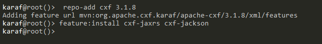

As in the previous tutorial, we also install dependency-injection:

```
feature:install pax-cdi 
install -s wrap:mvn:javax.inject/javax.inject/1
```

### Installing: bundle-lib
Execute the following on the Karaf command-line:
```
bundle:install -s mvn:com.owt4.demo/bundle-lib/1.0.0-SNAPSHOT
```

### Installing: bundle-api
Execute the following on the Karaf command-line:
```
bundle:install -s mvn:com.owt4.demo/bundle-api/1.0.0-SNAPSHOT
```

### Installing: bundle-impl
Execute the following on the Karaf command-line:
```
bundle:install -s mvn:com.owt4.demo/bundle-impl/1.0.0-SNAPSHOT
```

### Installing: bundle-rest
Execute the following on the Karaf command-line:
```
bundle:install -s mvn:com.owt4.demo/bundle-rest/1.0.0-SNAPSHOT
```

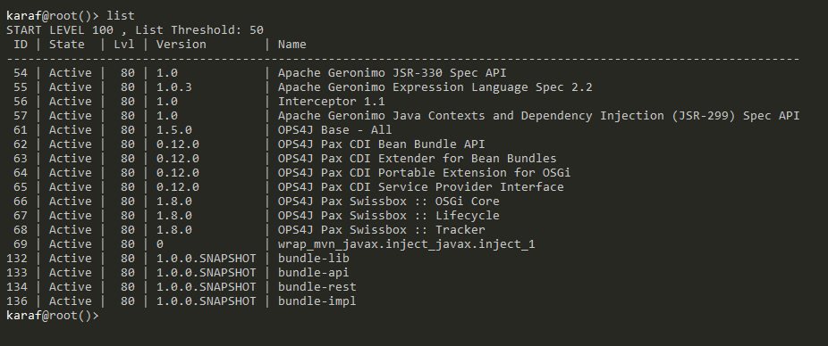


After `bundle-rest` is deployed, it is possible to verify the installation via command line with the help of `cxf-commands`.

Install `cxf-commands` feature:
```
feature:install cxf-commands
```

List CXF busses:
```
cxf:list-busses
```

List CXF endpoints:
```
cxf:list-endpoints
```

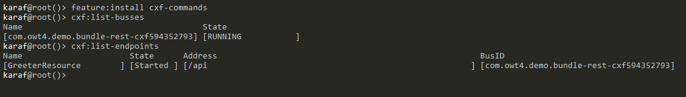

The REST endpoints are deployed on the embedded Jetty and they can be accessed via a browser at the default URL: http://localhost:8181/cxf

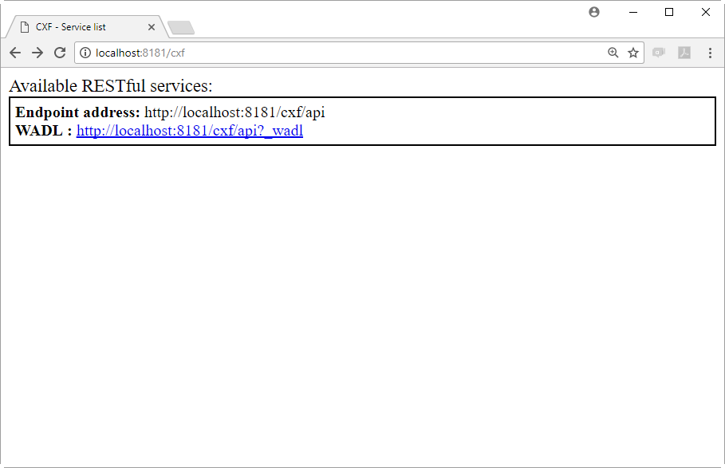

Where the WADL file is:

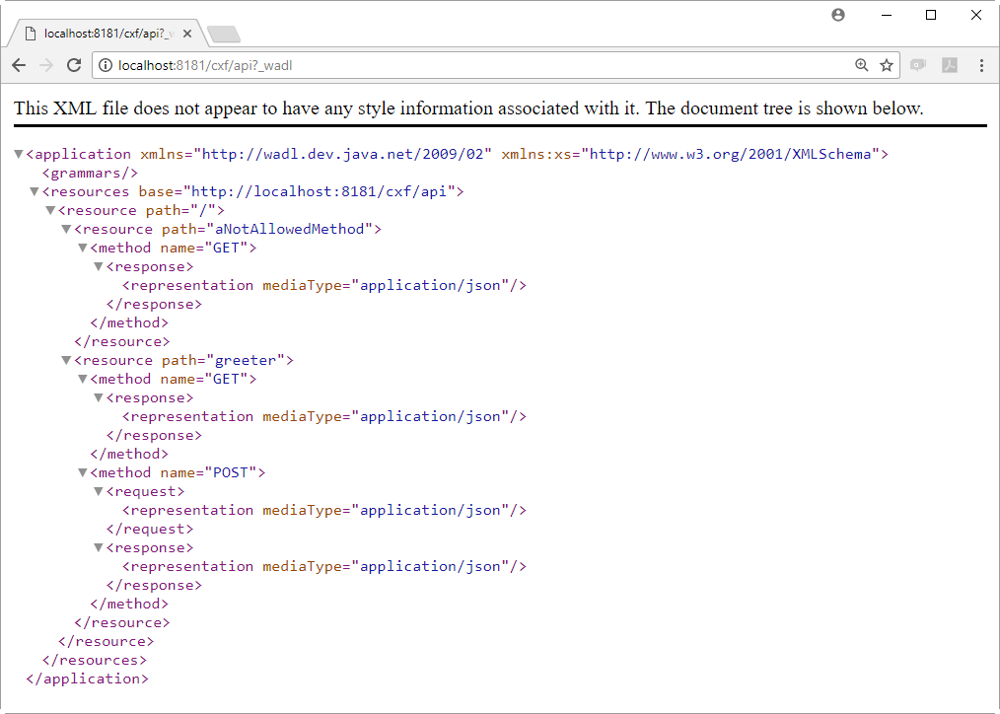

## 6. Testing With SoapUI
SoapUI is a tool commonly used by developers for web-service testing. It will be used in this tutorial to demonstrate the service's functionality.

> #### SoapUI
>
>[SoapUI](https://www.soapui.org/) is an open-source web service testing application for service-oriented architectures (SOA) and representational state transfers (REST). Its functionality covers web service inspection, invoking, development, simulation and mocking, functional testing, load and compliance testing.
 
 ### REST Project Creation
 In order to create a REST project, the following actions should be taken:

1. Click on: `File` -> `New REST Project`:
 
    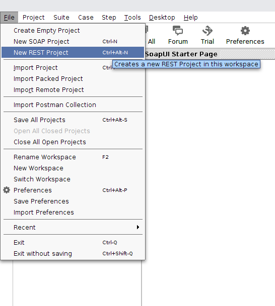

 2. In the `New REST Project` dialog, click on `Import WADL`:

    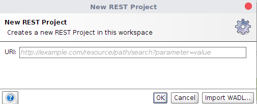

3. In the `New WADL Project` dialog, enter the URL observed previously when testing the deployment on the browser, and click on `OK`:

    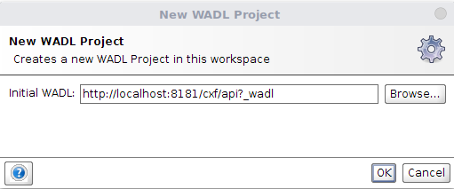

4. When successfully created, the REST project should look like this in SoapUI:

    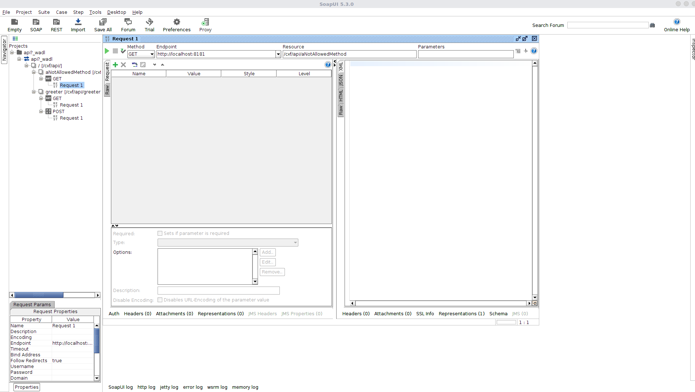

### Testing REST Services
Testing services is very easy in SoapUI. Clicking on the `Request 1` item in the tree menu on the left will open a "testing panel" that allows sending requests and observing responses from that service endpoint.

#### Testing: HTTP GET "greeter" Endpoint
When the testing panel for that endpoint is open, click on the `Parameters` text-field. This will open a popup that will allow entering request parameter name-value pairs. Enter "name" as the name, and anything you wish for value:

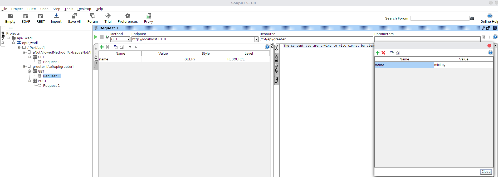

Click on the `"Play (green arrow)"` button to send the request to the service endpoint. When the response arrives, click in the `JSON` tab of the right-most panel to view the JSON response from the server:

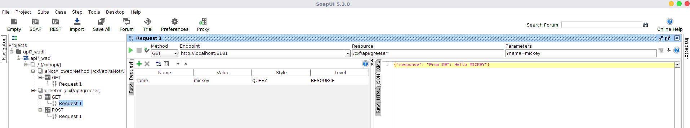

#### Testing: HTTP POST "greeter" Endpoint
Similarly with `GET`, the same name-value pair should be entered in `Parameters`. Only this time, the `Post QueryString` checkbox (bottom of screenshot) should be checked. Also, make sure that the `Media Type` is not changed from the default `application/x-www-form-urlencoded`.

After clicking on the `Play` button you should see something like this:

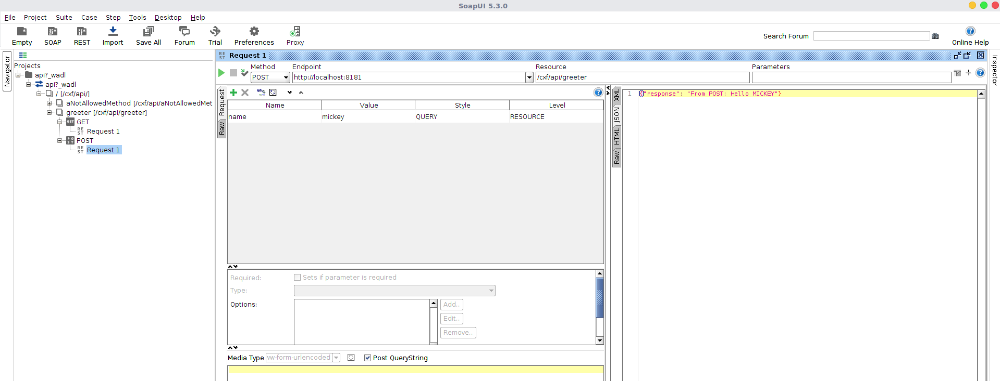

#### Testing: HTTP GET "aNotAllowedMethod" Endpoint
This `GET` method does not accept any request parameters, and also doesn't return any content to the client. Instead, clicking on it will return a `405 Method Not Allowed` HTTP status code. In order to see this, after clicking on `Play`, select the `Raw` tab on the right-most panel, as seen in the screenshot below:

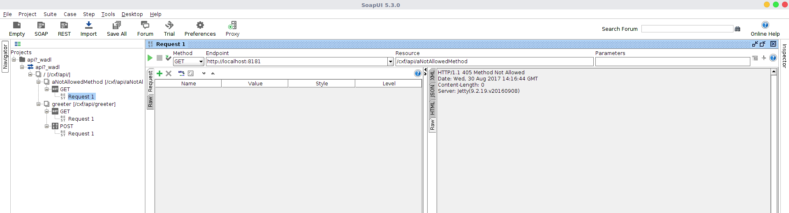
