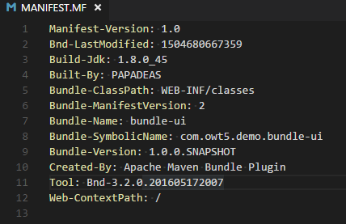
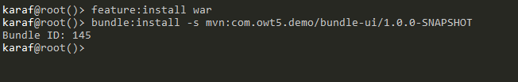
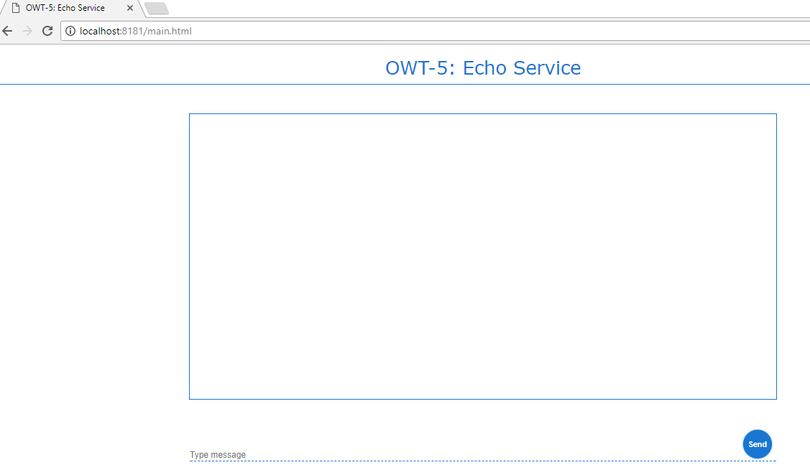

# OWT-5: Deploying a Web Application in Karaf


Table of Contents
=================

[TOC]


## 1. General Notes
This tutorial consists an introduction to web application deployment in Karaf. Based on a refactored version of OWT-4, where a web applcation bandle development and deployment are been explained.
This tutorial will demonstrate the following:
1. A single-page web application
2. A mechanism which will consume the service(s) defined in OWT-4, by using jQuery.


>The code for this tutorial is available in the code directory. It is recommended to have it checked-out locally and refer to it while going through the tutorial.
>All the maven modules detailed below have the standard maven directory structure.
>The code of this tutorial builds on the base provided by OWT-3. As a result, only new concepts/features will be explained here.


> #### Cleaning Karaf
> In order to avoid dependency conflicts and other configuration errors, we will make sure that Karaf is clean and unnecessary bundles are removed. _(Please note that this is not mandatory, but it is considered a good practice)_.
> 
> This is achieved by starting Karaf the following way:
> ```
> karaf.bat clean
> ```

## 2. Maven module: bundle-parent
As in previuous OWT sessions, the `bundle-parent` maven module serves as the _parent_ maven project for building the application/service. 

## 3. Maven module: bundle-lib
Library bundle. No changes from OWT-4.

## 4. Maven module: bundle-api
Likewise OWT-4, the bundle-api maven module hosts the Service API, where the service specification resides. However, in this tutorial it icnludes a new interface `EchoService` which spesifies the new service needed for OWT-5 demonstration purposies. 
`EchoService` is a simple service that contains the `echo` method signature only.

```java
public interface EchoService
```

### MessageDTO
Likewise OWT-4, the dto package hosts a simple DTO. In this OWT we will use MessageDTO to carry the message strings.


 ## 5. Maven module: bundle-impl
The service implemantation bundle-impl, contains the implementation class of EchoService. 
```java
@Singleton
@OsgiServiceProvider(classes = { EchoService.class })
public class EchoServiceImpl implements EchoService {
...
```
EchoServiceImpl class implements the `echo` method, where: 

After a random delay :
```java
        int randomDelay = ThreadLocalRandom.current().nextInt(min, max + 1);
        TimeUnit.SECONDS.sleep(randomDelay);
```
EchoServiceImpl returns the String result of [bubnle-lib]()
```java
    return util.upperCaseIt(text);
```

 ## 6. Maven module: bundle-rest

The bundle-rest maven module hosts the REST service. The service endpoints utilize the OSGi services which are declared in bundle-api and implemented in bundle-impl.At the bundle-rest package, the declared endpoint `postMessage`produces but also consumes JSON messages:

```java
    @Produces(MediaType.APPLICATION_JSON)
	@Consumes(MediaType.APPLICATION_JSON)
	public MessageDTO postMessage(MessageDTO messageDTO) {
        ...
    }
```
 The `postMessage` endpoint returns the response via `echoService` which echoes the given message.


## 7. Maven module: bundle-ui

The bunle-ui is a simple Maven Web project, containing all UI componenents needed enable deployment as bundle. Accessing OSGi servises via the REST entpoint.


First of all at pom.xml we need to set up _apache.felix_ to build a bundle with  `web context`:

```xml
    <plugin>
        <groupId>org.apache.felix</groupId>
        <artifactId>maven-bundle-plugin</artifactId>
        <version>${maven-bundle-plugin.version}</version>
        <extensions>true</extensions>
        <configuration>
            <instructions>
                <Web-ContextPath>/</Web-ContextPath>
                <_wab>src/main/webapp</_wab>
            </instructions>
        </configuration>
    </plugin>
```


After build the generated Manifest file will have a new entry `Web-ContextPath: /`

 

### Web content

As declared at `pom.xml`all web contentent will be placed at:`<_wab>src/main/webapp</_wab>`.
In this OWT we are using `jquery-3.2.1.min` and a custom JS library `script.js`.
Where `callService` function is actually sending the 'JSON' responses to the bundle REST endpoint `bundle-rest`.
In `callService` function there is an `ajax` call declararion where: 

- `url:` the url of the endpoint must be set
- `method:` the HTTP type of the endpoint must be set
- `data:` the optional response message
- `contentType:` The media type of response message 


```javascript
// may be relative also
var SERVICE_URL = 'http://localhost:8181/cxf/api/echo/';

function callService(message) {
    var data = new Object();
    data.message = message;
    $.ajax({
        url: SERVICE_URL,
        method: 'POST',
        data: JSON.stringify(data),
        contentType: 'application/json; charset=utf-8'
    }).done(function (response) {
        //.. handle done
    }).fail(function (jqxhr, textStatus, error) {
        //... handle fail
    });
}
```


### Apache Karaf WebContainer

Apache Karaf can act as a complete WebContainer, fully supporting JSP/Servlet specification.
`Apache Karaf WebContainer` supports both:
- WAB (WebApplication Bundles) which are OSGi native web applications
- WAR (WebApplication aRchives) which are non-OSGi web applications (the same as you can deploy in any web container like Apache Tomcat)

To enable the Apache Karaf WebContainer, you just have to install the `war feature`:

        karaf@root()> feature:install war

The `war feature` includes an embedded web container (powered by Jetty), with its configuration but also `war feature` provides a set of console commands and a new war deployer

>Note: `war feature` uses by default http://localhost:8181/ which also by default is mapped to {`Web-ContextPath` decalred at manifest}/index.html. Any other page placed at 'Web-ContextPath' is accessed as: `http://localhost:8181/AnyOtherPage.html`.


## 8. Installing the Bundles on Karaf
Before installing the bundles themselves, Karaf must me prepared as described below:


#### Installing dependencies

Likewise OWT-4, since we clean the  Karaf, we have to re-install all the nessesary dependencies:

Apache CXF repository:
```
repo-add cxf 3.1.8
```

 After repository CXF features can be installed:`cxf-jaxrs` and `cxf-jackson`

``` 
feature:install cxf-jaxrs cxf-jackson
```

We also install dependency-injection depedencies:

```
feature:install pax-cdi 
install -s wrap:mvn:javax.inject/javax.inject/1
```


As mentioned [before](Link gia to chapter!!!!), to deploy web based modules, we need to setup `Apache Karaf WebContainer` by installing the plugin `war feature`:


```
feature:install war
```


### Installing: bundle-lib
Execute the following on the Karaf command-line:
```
bundle:install -s mvn:com.owt5.demo/bundle-lib/1.0.0-SNAPSHOT
```

### Installing: bundle-api
Execute the following on the Karaf command-line:
```
bundle:install -s mvn:com.owt5.demo/bundle-api/1.0.0-SNAPSHOT
```

### Installing: bundle-impl
Execute the following on the Karaf command-line:
```
bundle:install -s mvn:com.owt5.demo/bundle-impl/1.0.0-SNAPSHOT
```

### Installing: bundle-rest
Execute the following on the Karaf command-line:
```
bundle:install -s mvn:com.owt5.demo/bundle-rest/1.0.0-SNAPSHOT
```

### Installing: bundle-ui


```
bundle:install -s mvn:com.owt5.demo/bundle-ui/1.0.0-SNAPSHOT
```




### The web page

As mentioned before the deployed web page can be accessed at http://localhost:8181/main.html



