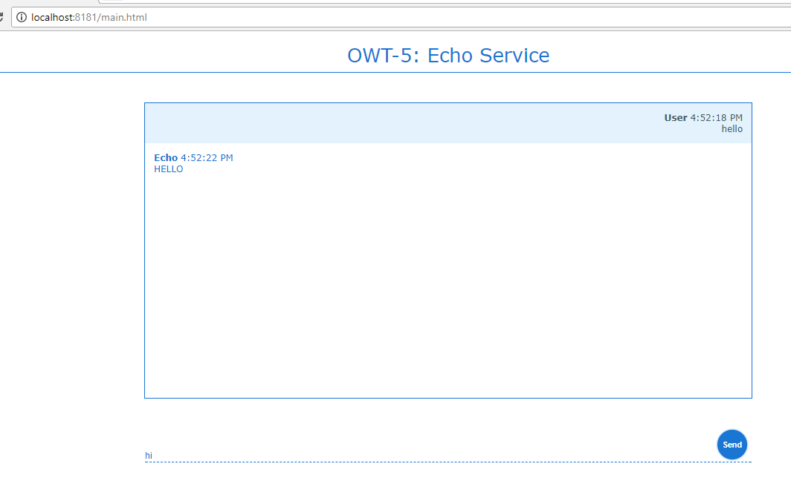

# OWT-5: Deploying a Web Application in Karaf


Table of Contents
=================
 * [1\. General Notes](#1-general-notes)
      * [Cleaning Karaf](#cleaning-karaf)
  * [2\. Maven Module: bundle\-parent](#2-maven-module-bundle-parent)
  * [3\. Maven Module: bundle\-lib](#3-maven-module-bundle-lib)
  * [4\. Maven Module: bundle\-api](#4-maven-module-bundle-api)
      * [MessageDTO](#messagedto)
  * [5\. Maven Module: bundle\-impl](#5-maven-module-bundle-impl)
      * [Annotations](#annotations)
      * [Business Logic](#business-logic)
  * [6\. Maven Module: bundle\-rest](#6-maven-module-bundle-rest)
      * [REST Endpoint](#rest-endpoint)
    * [The WADL](#the-wadl)
  * [7\. Maven Module: bundle\-ui](#7-maven-module-bundle-ui)
      * [Maven Bundle Plugin](#maven-bundle-plugin)
    * [Web Technology Used](#web-technology-used)
      * [HTML](#html)
      * [CSS](#css)
      * [Javascript](#javascript)
      * [jQuery](#jquery)
    * [UI Layout &amp; Styling](#ui-layout--styling)
      * [Main Content](#main-content)
    * [Business Logic](#business-logic-1)
      * [Endpoint Definition](#endpoint-definition)
      * [Sending Messages](#sending-messages)
      * [Calling the REST Service](#calling-the-rest-service)
    * [Apache Karaf WebContainer](#apache-karaf-webcontainer)
      * [Karaf: war feature](#karaf-war-feature)
  * [8\. Installing the Bundles on Karaf](#8-installing-the-bundles-on-karaf)
      * [Installing dependencies](#installing-dependencies)
    * [Installing: bundle\-lib](#installing-bundle-lib)
    * [Installing: bundle\-api](#installing-bundle-api)
    * [Installing: bundle\-impl](#installing-bundle-impl)
    * [Installing: bundle\-rest](#installing-bundle-rest)
    * [Installing: bundle\-ui](#installing-bundle-ui)
    * [The web page](#the-web-page)


## 1. General Notes
This tutorial is an introduction on how to deploy a web application in Karaf. It is based on a modified version of OWT-4, in which the development and the deployment of a web application bundle were explained.


This tutorial will demonstrate the following:
1. A single-page web application
2. A mechanism which will consume REST services - like the ones defined in OWT-4 - by using jQuery.


>The code for this tutorial is available in the `code` directory. It is recommended to have it checked-out locally and refer to it while going through the tutorial.
>All the maven modules detailed below have the standard maven directory structure.
>The code of this tutorial builds on the base provided by OWT-4. As a result, only new concepts/features will be explained here.


> #### Cleaning Karaf
> In order to avoid dependency conflicts and other configuration errors, we will make sure that Karaf is clean and unnecessary bundles are removed. _(Please note that this is not mandatory, but it is considered a good practice)_.
>
> This is achieved by starting Karaf the following way (for Windows):
> ```
> karaf.bat clean
> ```

## 2. Maven Module: bundle-parent
As in previous OWT sessions, the `bundle-parent` maven module serves as the _parent_ maven project for building the application/service.

## 3. Maven Module: bundle-lib
Library bundle. No changes from OWT-4.

## 4. Maven Module: bundle-api
Likewise OWT-4, the bundle-api maven module hosts the Service API, where the service specification resides. However, this tutorial includes the new interface `EchoService` which specifies the new service needed for OWT-5 demonstration purposes.
EchoService is a simple service that contains the `echo` method signature only.

```java
public interface EchoService {

    String echo(String text);

}
```

> #### MessageDTO
>
> The `com.owt5.api.dto` package hosts a single class, used to transport the messages between client and server. This object is serialized to JSON when transmitted on the network, and de-serialized for use on both client and server.


 ## 5. Maven Module: bundle-impl
The module contains the `com.owt5.impl.EchoServiceImpl` class, that implements EchoService.

> #### Annotations
> The `@Singleton` annotation states that there will be a single instance of this class deployed on the OSGi container/server. 
> The `@OsgiServiceProvider` annotation declares that this class is a provider of `EchoService`.
>
> ```java
> @Singleton
> @OsgiServiceProvider(classes = { EchoService.class })
> public class EchoServiceImpl implements EchoService {
>```

> #### Business Logic
> The `echo` method contains the code of the service implementation. In order to create the illusion of a response from another person, a random delay between 1 and 4 seconds is introduced before the response message is created.
> The response message itself will just be a capitalized version of the original user message.
>
> ```java
> int randomDelay = ThreadLocalRandom.current().nextInt(min, max + 1);
> TimeUnit.SECONDS.sleep(randomDelay);
> return util.upperCaseIt(text);
>```

 ## 6. Maven Module: bundle-rest

This bundle hosts the REST service. The service endpoints utilize the OSGi services which are declared in `bundle-api` and implemented in `bundle-impl`. At the bundle-rest package, the declared endpoint `postMessage`produces but also consumes JSON messages:

> #### REST Endpoint
> This is a `POST` endpoint, listening on the `/echo` relative path. 
> It uses JSON strings as both input and output.
>
> ```java
> @POST
> @Path("/echo")
> @Consumes(MediaType.APPLICATION_JSON)
> @Produces(MediaType.APPLICATION_JSON)
> public MessageDTO postMessage(MessageDTO messageDTO) {
>   ...
> }
>```

### The WADL
Below is the echo service WADL:

 


## 7. Maven Module: bundle-ui
The bundle-ui is a Maven project which contains the web content and the configuration required in order to deploy itself as a web application on the embedded Jetty container.


First of all at pom.xml we need to set up _apache.felix_ to build a bundle with `web context`:

> #### Maven Bundle Plugin
> The BND plugin is responsible to create the OSGi bundle. In this tutorial though, some extra configuration is required. Certain `instructions` will be passed to the it that will ensure successful deployment.
> More specifically, the `Web-ContextPath` instruction sets the web context root of the web-app to `/`, and the `_wab` instruction tells the plugin to include the resources inside the _src/main/webapp_ directory as the bundle content. That directory contains the HTML, Javascript, and CSS content of the application.
>
> ```xml
> <plugin>
>   <groupId>org.apache.felix</groupId>
>   <artifactId>maven-bundle-plugin</artifactId>
>   <version>${maven-bundle-plugin.version}</version>
>   <extensions>true</extensions>
>   <configuration>
>       <instructions>
>           <Web-ContextPath>/</Web-ContextPath>
>           <_wab>src/main/webapp</_wab>
>       </instructions>
>   </configuration>
> </plugin>
>```


Once it is built, the generated Manifest file will have a new entry: `Web-ContextPath`.

 

### Web Technology Used
In order to create the user interface for the application of this tutorial, the following technologies were used.

> #### HTML
>
> HTML is the standard markup language for creating Web pages.
> - HTML stands for Hyper Text Markup Language.
> - It describes the structure of Web pages using markup.
> - Its elements are the building blocks of HTML pages and are represented by tags
> - HTML tags label pieces of content such as "heading", "paragraph", "table", and so on.
> - Browsers do not display the HTML tags themselves, but use them to render the content of the page.

> #### CSS
>
> Cascading Style Sheets (CSS) is a style sheet language used for describing the presentation of a document written in a markup language. Although most often used to set the visual style of web pages and user interfaces written in HTML and XHTML, the language can be applied to any XML document, including plain XML, SVG and XUL, and is applicable to rendering in speech, or on other media.

> #### Javascript
>
> JavaScript, often abbreviated as JS, is a high-level, dynamic, weakly typed, object-based, multi-paradigm, and interpreted programming language. It supports event-driven, functional, and imperative (including object-oriented and prototype-based) programming styles. It has an API covering working with text, arrays, dates, regular expressions, basic manipulation of the DOM, and more.

> #### jQuery
>
> jQuery is a fast, small, and feature-rich JavaScript library. It makes things like HTML document traversal and manipulation, event handling, animation, and Ajax much simpler with an easy-to-use API that works across a multitude of browsers.

### UI Layout & Styling
The user interface components are laid-out and styled in the `main.html` and `style.css` files.

> #### Main Content
> As it can be seen in the HTML snippet, the content `div` contains a header element, the message log box where all messages are displayed, and the controls where message input and the Send button reside. Each of these elements has an `id` attribute.
>
> ```html
> <div id="content">
>   <div id="header">OWT-5: Echo Service</div>
>   <div id="message-log"></div>
>   <div id="controls">
>       <input id="message-input" type="text" placeholder="Type message">
>       <button id="send">Send</button>
>   </div>
> </div>
>```
>
> These `id` attributes are used in the CSS file to assign style information to their elements, as with the `header` element below.
>
> ```css
> ...
>
> #header{
>   padding: 20px 0 10px;
>   font-size: 32px;
>   background: #ffffff;
>   color: #1976D2;
>   border-bottom: 1px solid #1976D2;
> }
>
> ...
>

### Business Logic
The Javascript/jQuery code for this tutorial is quite straight-forward. By examining the _src/main/webapp/script.js_ file we can identify the following points of interest.

> #### Endpoint Definition
> Here we simply assign the relative URL of the REST service endpoint to a variable. Since the webapp is deployed on the Karaf-embedded Jetty, the complete URL should be something like `http://localhost:8181/cxf/api/echo/`.
>
> ```js
> var SERVICE_URL = '/cxf/api/echo/';
>```

> #### Sending Messages
> This snippet shows what actually occurs when the user sends a message. The text is trimmed (leading and trailing whitespace removed), and if the result is not an empty string, it is added to the message log (the panel that displays all messages). Once that happens, it will be sent to the REST service.
>
> ```js
> function sendMessage() {
>   var message = $('#message-input').val();
>   if ($.trim(message).length == 0) {
>       return;
>   }
>   addUserMessageToLog(message);
>   callService(message);
> }
>```

> #### Calling the REST Service
> This function is responsible for sending the message to the REST service, and then handling the response. 
> The `url` is the relative (or may be absolute) URL of the REST endpoint. 
> The `method` is the HTTP method used for the request.
> The `data` is the JSON string that will be sent as the POST message body.
> The `contentType` declares the content type, and **must** match the one specified in the REST endpoint definition on the Java side.
> If the request is successful, the `done` function will be executed, resulting to showing the received "Echo" message in the UI _(Please note that the response is received in an asynchronous and non-blocking fashion)_.
> In case of error, the `fail` function is executed, and it will display an alert with the cause of the error.
>
> ```js
> function callService(message) {
> var data = new Object();
> data.message = message;
>   $.ajax({
>       url: SERVICE_URL,
>       method: 'POST',
>       data: JSON.stringify(data),
>       contentType: 'application/json; charset=utf-8'
>   }).done(function (response) {
>       addEchoMessageToLog(response.message);
>   }).fail(function (jqxhr, textStatus, error) {
>       var err = textStatus + ", " + jqxhr.responseText;
>       alert("Request Failed: " + err);
>   });
> }
>```

### Apache Karaf WebContainer
Apache Karaf can act as a fully-featured web container, supporting JSP/Servlet specification.
`Apache Karaf WebContainer` supports both:
- WAB (WebApplication Bundles) which are OSGi native web applications
- WAR (WebApplication aRchives) which are non-OSGi web applications (the same as you can deploy in any web container like Apache Tomcat)

To enable the Apache Karaf WebContainer, you just have to install the `war feature`:
```
karaf@root()> feature:install war
```

> #### Karaf: war feature
> The following are true for the `war` feature of Karaf:
> - The `war` feature includes an embedded servlet container (powered by Jetty)
> - It provides a set of console commands and a war deployment mechanism.
> - It uses by default this URL as the servlet container root: `http://localhost:8181/` which is also (by default) mapped to {`Web-ContextPath` declared at manifest}/index.html. Any other page placed at 'Web-ContextPath' is accessed as: `http://localhost:8181/AnyOtherPage.html`.

## 8. Installing the Bundles on Karaf
Before installing the bundles themselves, Karaf must me prepared as described below:

#### Installing dependencies

As in OWT-4, since Karaf was cleaned of deployments, all the necessary dependencies must be re-installed:

Apache CXF repository:
```
repo-add cxf 3.1.8
```

After repository CXF features can be installed: `cxf-jaxrs` and `cxf-jackson`
```
feature:install cxf-jaxrs cxf-jackson
```

Install dependency-injection:
```
feature:install pax-cdi
install -s wrap:mvn:javax.inject/javax.inject/1
```

As mentioned [before](#apache-karaf-webcontainer), to deploy web based modules, we need to setup `Apache Karaf WebContainer` by installing the plugin `war feature`:

```
feature:install war
```

### Installing: bundle-lib
Execute the following on the Karaf command-line:
```
bundle:install -s mvn:com.owt5.demo/bundle-lib/1.0.0-SNAPSHOT
```

### Installing: bundle-api
Execute the following on the Karaf command-line:
```
bundle:install -s mvn:com.owt5.demo/bundle-api/1.0.0-SNAPSHOT
```

### Installing: bundle-impl
Execute the following on the Karaf command-line:
```
bundle:install -s mvn:com.owt5.demo/bundle-impl/1.0.0-SNAPSHOT
```

### Installing: bundle-rest
Execute the following on the Karaf command-line:
```
bundle:install -s mvn:com.owt5.demo/bundle-rest/1.0.0-SNAPSHOT
```

### Installing: bundle-ui
Execute the following on the Karaf command-line:
```
bundle:install -s mvn:com.owt5.demo/bundle-ui/1.0.0-SNAPSHOT
```


### The Web Page

As mentioned before the deployed web page can be accessed at http://localhost:8181/main.html


Using the `Echo` service:


