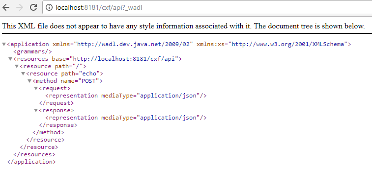
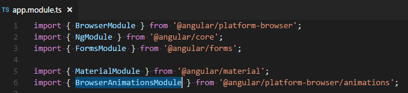

# OWT-6: Deploying an Angular Web Application in Karaf


Table of Contents
=================
[TOC]


## 1. General Notes
This tutorial is an introduction on how to deploy an Angular web application in Karaf.
It is a modified version of OWT-5, in which the development and the deployment of an Angular web application were explained.


This tutorial will demonstrate the following:
1. A single-page web application buid in Angular.
2. A mechanism which will consume REST services - like the ones defined in OWT-5 - by using Angular.


>The code for this tutorial is available in the `code` directory. It is recommended to have it checked-out locally and refer to it while going through the tutorial.
>All the maven modules detailed below have the standard maven directory structure.
>The code of this tutorial builds on the base provided by OWT-5. As a result, only new concepts/features will be explained here.


> #### Cleaning Karaf
> In order to avoid dependency conflicts and other configuration errors, we will make sure that Karaf is clean and unnecessary bundles are removed. _(Please note that this is not mandatory, but it is considered a good practice)_.
>
> This is achieved by starting Karaf the following way (for Windows):
> ```
> karaf.bat clean
> ```

## 2. Maven Module: bundle-parent
As in previous OWT sessions, the `bundle-parent` maven module serves as the _parent_ maven project for building the application/service.

## 3. Maven Module: bundle-lib
Library bundle. No changes from OWT-5.

## 4. Maven Module: bundle-api
The Services container bundle. No changes from OWT-5.

 ## 5. Maven Module: bundle-impl
The Service implementation module. No changes from OWT-5.

 ## 6. Maven Module: bundle-rest

This bundle hosts the REST service. No changes from OWT-5.

### The WADL
Below is the echo service WADL, same as OWT-5:

 


## 7. Angular project: angular-ui
The angular-ui is an Angular project which contains the web content and the configuration required in order to deploy itself as an Angular web application.


## Web Technology Used
In order to create the user interface for the application of this tutorial, the following technologies were used.


> ### Angular 
Angular (commonly referred to as "Angular 2+" or "Angular 2") is a TypeScript-based open-source front-end web application platform led by the Angular Team at Google and by a community of individuals and corporations to address all of the parts of the developer's workflow while building complex web applications. Angular is a complete rewrite from the same team that built AngularJS.


## Creating an Angular Web application

.../

### Setup Enviroment Prerequisites

####Install Node.js® and NPM on Windows

- Download the Windows installer from the Nodes.js® [web site](https://nodejs.org/en/)
- Run the installer (the .msi file you downloaded in the previous step.)
- Follow the prompts in the installer (Accept the license agreement, click the NEXT button a bunch of times and accept the default installation settings).


 


> ### npm

NPM stands for Node Package Manager. It's an online repository of node packages that can be quickly and programmatically installed from the command line, with the `npm` command line interface that comes with Node.

### Angular Angular CDK (compiler-cli)
Angular cli is a command line interface to scaffold and build angular apps using nodejs style (commonJs) modules. Not only it provides you scalable project structure, instead it handles all common tedious tasks for you out of the box.

To install Angular cli use the npm tool:

    npm install --save @angular/compiler-cli 


Create a new Angular project called angular-ui:

    ng new angular-ui --style scss

This will create a new Angular 2 project from scratch and set it up so that you can use SASS as CSS preprocessor. If you go inside the angular-ui folder that should have just been created you’ll find a folder structure that will look more or less like this:


```shell

 # App source code (and specs)
- src
  |- app                 # your app source code (and specs)
  |- assets              # static assets like images, etc
  |- index.html          # the entry point to your app
  |- styles.scss         # the global styles for your app
  |- environments        # here you can define different environment configuration (prod, dev, etc)

# Dependencies
- node_modules          # the source code of your app's dependencies
- package.json          # the manifest of your app that states all dependencies 

# TypeScript configuration
- main.ts               # The main entry point for your app
- tsconfig.json         # TypeScript compiler configuration
- tslint.json           # TypeScript linting configuration

# Testing
- e2e                   # a folder with end to end tests
- karma.conf.js         # karma test runner configuration
- protractor.conf.js    # protractor e2e tests configuration

```


### Angular modules

Modules are a great way to organize an application and extend it with capabilities from external libraries.
Many Angular libraries are modules (such as FormsModule, HttpModule, and RouterModule). Many third-party libraries are available as NgModules (such as Material Design, Ionic, AngularFire2).

#### Bootstrapping in main.ts

The main entry point `main.ts` compiles the application with the JIT compiler and bootstraps the application's root module to run in the browser:

```ts

    platformBrowserDynamic().bootstrapModule(AppModule);

```


#### The root AppModule

Every Angular app has a root module class. By convention, the root module class is called `AppModule` and it exists in a file named `app.module.ts`.

A simple AppModule:
```ts
import { NgModule }      from '@angular/core';
import { BrowserModule } from '@angular/platform-browser';
import { AppComponent }  from './app.component';

@NgModule({
  imports:      [ BrowserModule ],
  declarations: [ AppComponent ],
  bootstrap:    [ AppComponent ]
})
export class AppModule { }
```

#### The NgModule

An `NgModule` is a class adorned with the `@NgModule` decorator function. @NgModule takes a metadata object that tells Angular how to compile and run module code. It identifies the module's own components, directives, and pipes, making some of them public so external components can use them. @NgModule may add service providers to the application dependency injectors.

The following table summarizes the NgModule metadata properties.

Property|Description
---|--------
declarations|A list of declarable classes, the component, directive, and pipe classes that belong to this module.These declared classes are visible within the module but invisible to components in a different module.
providers| A list of dependency-injection providers.
imports | A list of supporting modules.
exports| A list of declarations—component, directive, and pipe classes—that an importing module can use.
bootstrap| A list of components that can be bootstrapped.
entryComponents| A list of components that are not referenced in a reachable component template.


Import the NgModule for each component you want to use:

```ts
@NgModule({
  declarations: [
    AppComponent
  ],
  imports: [
    BrowserModule,
    MaterialModule,
    BrowserAnimationsModule,
  ],
  providers: [],
  bootstrap: [AppComponent]
})
```


### UI Layout & Styling
The user interface components are laid-out and styled in the `app.component.html` and `style.css` files.


#### Step 1: Install Angular Material

 Material Design components are pre built ui components, created for and with Angular.

    npm install --save @angular/material


#### Step 2: Animations
Some Material components depend on the `Angular animations module` in order to be able to do more advanced transitions. 
To enable these animations to your app, you have to install the `@angular/animations module` 

        npm install --save @angular/animations


Also include the `BrowserAnimationsModule` in your app:
 


### Step 3: Import the component modules

As mentioned [before LINK pending](pending),


### Step 4: Include a theme

Including a theme is required to apply all of the core and theme styles to your application.

Edit `Style.scss` and add at the top of it:

    @import '~@angular/material/prebuilt-themes/indigo-pink.css';


### Step 5:
Some components rely on library `HammerJS` for gestures. In order to get the full feature-set of these components, HammerJS must be loaded into the application:

    npm install --save hammerjs


You can test that everything works as it should by running the development server. Type the following command:

     ng serve --open


> #### Main Content
> As it can be seen in the HTML snippet, the content `div` contains a header element, the message log box where all messages are displayed, and the controls where message input and the Send button reside. Each of these elements has an `id` attribute.
>
> ```html
> <div id="content">
>   <div id="header">OWT-5: Echo Service</div>
>   <div id="message-log"></div>
>   <div id="controls">
>       <input id="message-input" type="text" placeholder="Type message">
>       <button id="send">Send</button>
>   </div>
> </div>
>```
>
> These `id` attributes are used in the CSS file to assign style information to their elements, as with the `header` element below.
>
> ```css
> ...
>
> #header{
>   padding: 20px 0 10px;
>   font-size: 32px;
>   background: #ffffff;
>   color: #1976D2;
>   border-bottom: 1px solid #1976D2;
> }
>
> ...
>

### Business Logic
The Javascript/jQuery code for this tutorial is quite straight-forward. By examining the _src/main/webapp/script.js_ file we can identify the following points of interest.

> #### Endpoint Definition
> Here we simply assign the relative URL of the REST service endpoint to a variable. Since the webapp is deployed on the Karaf-embedded Jetty, the complete URL should be something like `http://localhost:8181/cxf/api/echo/`.
>
> ```js
> var SERVICE_URL = '/cxf/api/echo/';
>```

> #### Sending Messages
> This snippet shows what actually occurs when the user sends a message. The text is trimmed (leading and trailing whitespace removed), and if the result is not an empty string, it is added to the message log (the panel that displays all messages). Once that happens, it will be sent to the REST service.
>
> ```js
> function sendMessage() {
>   var message = $('#message-input').val();
>   if ($.trim(message).length == 0) {
>       return;
>   }
>   addUserMessageToLog(message);
>   callService(message);
> }
>```

> #### Calling the REST Service via an Angular Service

#TODO TODO allagh ola auta

> This function is responsible for sending the message to the REST service, and then handling the response. 
> The `url` is the relative (or may be absolute) URL of the REST endpoint. 
> The `method` is the HTTP method used for the request.
> The `data` is the JSON string that will be sent as the POST message body.
> The `contentType` declares the content type, and **must** match the one specified in the REST endpoint definition on the Java side.
> If the request is successful, the `done` function will be executed, resulting to showing the received "Echo" message in the UI _(Please note that the response is received in an asynchronous and non-blocking fashion)_.
> In case of error, the `fail` function is executed, and it will display an alert with the cause of the error.
>
> ```js
> function callService(message) {
> var data = new Object();
> data.message = message;
>   $.ajax({
>       url: SERVICE_URL,
>       method: 'POST',
>       data: JSON.stringify(data),
>       contentType: 'application/json; charset=utf-8'
>   }).done(function (response) {
>       addEchoMessageToLog(response.message);
>   }).fail(function (jqxhr, textStatus, error) {
>       var err = textStatus + ", " + jqxhr.responseText;
>       alert("Request Failed: " + err);
>   });
> }
>```


### Apache Karaf WebContainer

> #### Karaf: war feature

DEN TO XRHSIMOPOIOU?ME EDW?


## 8. Installing the Bundles on Karaf
Before installing the bundles themselves, Karaf must me prepared as described below:

#### Installing dependencies

As in OWT-4, since Karaf was cleaned of deployments, all the necessary dependencies must be re-installed:

Apache CXF repository:
```
repo-add cxf 3.1.8
```

After repository CXF features can be installed: `cxf-jaxrs` and `cxf-jackson`
```
feature:install cxf-jaxrs cxf-jackson
```

Install dependency-injection:
```
feature:install pax-cdi
install -s wrap:mvn:javax.inject/javax.inject/1
```

As mentioned [before](#apache-karaf-webcontainer), to deploy web based modules, we need to setup `Apache Karaf WebContainer` by installing the plugin `war feature`:

```
feature:install war
```


### Installing: bundle-lib
Execute the following on the Karaf command-line:
```
bundle:install -s mvn:com.owt6.demo/bundle-lib/1.0.0-SNAPSHOT
```

### Installing: bundle-api
Execute the following on the Karaf command-line:
```
bundle:install -s mvn:com.owt6.demo/bundle-api/1.0.0-SNAPSHOT
```

### Installing: bundle-impl
Execute the following on the Karaf command-line:
```
bundle:install -s mvn:com.owt6.demo/bundle-impl/1.0.0-SNAPSHOT
```

### Installing: bundle-rest
Execute the following on the Karaf command-line:
```
bundle:install -s mvn:com.owt6.demo/bundle-rest/1.0.0-SNAPSHOT
```
