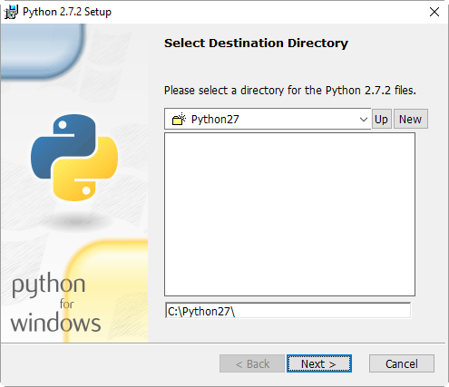
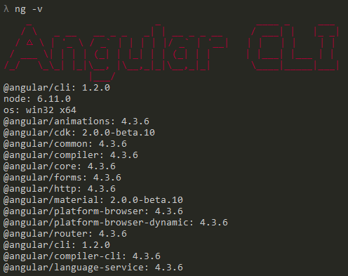
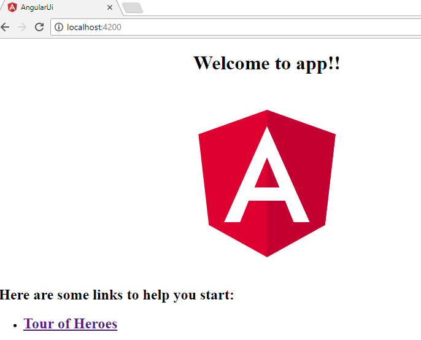

# OWT-6: Deploying an Angular Web Application in Karaf


Table of Contents
=================
[TOC]


## 1. General Notes
This tutorial is an introduction on how to deploy an Angular web application in Karaf.
It is a modified version of OWT-5, in which the development and the deployment of an Angular web application were explained.


This tutorial will demonstrate the following:
1. A single-page web application build in Angular.
2. A mechanism which will consume REST services - like the ones defined in OWT-5 - by using Angular.


>The code for this tutorial is available in the `code` directory. It is recommended to have it checked-out locally and refer to it while going through the tutorial.
>All the maven modules detailed below have the standard maven directory structure.
>The code of this tutorial builds on the base provided by OWT-5. As a result, only new concepts/features will be explained here.


> #### Cleaning Karaf
> In order to avoid dependency conflicts and other configuration errors, we will make sure that Karaf is clean and unnecessary bundles are removed. _(Please note that this is not mandatory, but it is considered a good practice)_.
>
> This is achieved by starting Karaf the following way (for Windows):
> ```
> karaf.bat clean
> ```

## 2. Maven Module: bundle-parent
As in previous OWT sessions, the `bundle-parent` maven module serves as the _parent_ maven project for building the application/service.

## 3. Maven Module: bundle-lib
Library bundle. No changes from OWT-5.

## 4. Maven Module: bundle-api
The Services container bundle. No changes from OWT-5.

 ## 5. Maven Module: bundle-impl
The Service implementation module. No changes from OWT-5.

 ## 6. Maven Module: bundle-rest

This bundle hosts the REST service. No changes from OWT-5.

### The WADL
Below is the echo service WADL, same as OWT-5:

 


## 7. Angular project: angular-ui
The angular-ui is an Angular project which contains the web content and the configuration required in order to deploy itself as an Angular web application. 


### Web Technology Used
In order to create the user interface for the application of this tutorial, the following technologies were used.


> ### Angular
> Angular (commonly referred to as "Angular 2+" or "Angular 2") is a TypeScript-based open-source front-end web application platform 
> led by the Angular Team at Google and by a community of individuals and corporations to address all of the parts of the 
> developer's workflow while building complex web applications. Angular is a complete rewrite from the same team that built AngularJS.


## Creating an Angular Web application

In order to create an Angular web application first we need to setup some environment prerequisites.


#### Install Python

Download and install Python 2.7.* version from [python.org/downloads](https://www.python.org/downloads/).
 >Note: This tutorial uses version 2.7.2.

 


#### Install Node.js® and NPM on Windows

- Download the Windows installer from the Nodes.js® [web site](https://nodejs.org/en/)
- Run the installer (the .msi file you downloaded in the previous step.)
- Follow the prompts in the installer (Accept the license agreement, click the NEXT button a bunch of times and accept the default installation settings).


 


> ### npm
>
>NPM stands for Node Package Manager. It's an online repository of node packages that can be quickly and programmatically installed 
>from the command line, with the `npm` command line interface that comes with Node.


### Create Angular App


Create a new Angular project called **angular-ui**:

    ng new angular-ui --style scss

This will create a new `Angular 2` project from scratch and set it up so that you can use SASS as CSS processor.

Inside the `angular-ui` folder that should have just been created, you’ll find a folder structure that will look more or less like this:


```shell

 # App source code (and specs)
- src
  |- app                 # your app source code (and specs)
  |- assets              # static assets like images, etc
  |- index.html          # the entry point to your app
  |- styles.scss         # the global styles for your app
  |- environments        # here you can define different environment configuration (prod, dev, etc)

# Dependencies
- node_modules          # the source code of your app's dependencies
- package.json          # the manifest of your app that states all dependencies

# TypeScript configuration
- main.ts               # The main entry point for your app
- tsconfig.json         # TypeScript compiler configuration
- tslint.json           # TypeScript linting configuration

# Testing
- e2e                   # a folder with end to end tests
- karma.conf.js         # karma test runner configuration
- protractor.conf.js    # protractor e2e tests configuration

```


>### Angular modules
>Modules are a great way to organize an application and extend it with capabilities from external libraries.
>Many Angular libraries are modules (such as FormsModule, HttpModule, and RouterModule). Many third-party libraries are available as 
>NgModules (such as Material Design, Ionic, AngularFire2).

#### Bootstrapping in main.ts

The main entry point `main.ts` compiles the application with the JIT compiler and bootstraps the application's root module to run in the browser:

```ts

    platformBrowserDynamic().bootstrapModule(AppModule);

```


#### The root AppModule

>Every Angular app has a root module class. By convention, the root module class is called `AppModule` and it exists in a file named 
>`app.module.ts`.

A simple AppModule:
```ts
import { NgModule }      from '@angular/core';
import { BrowserModule } from '@angular/platform-browser';
import { AppComponent }  from './app.component';

@NgModule({
  imports:      [ BrowserModule ],
  declarations: [ AppComponent ],
  bootstrap:    [ AppComponent ]
})
export class AppModule { }
```

>#### The NgModule
>
>An `NgModule` is a class adorned with the `@NgModule` decorator function. @NgModule takes a metadata object that tells Angular how 
>to compile and run module code. It identifies the module's own components, directives, and pipes, making some of them public so 
>external components can use them. @NgModule may add service providers to the application dependency injectors.

The following table summarizes the NgModule metadata properties:

Property|Description
---|--------
declarations|A list of declarable classes, the component, directive, and pipe classes that belong to this module.These declared classes are visible within the module but invisible to components in a different module.
providers| A list of dependency-injection providers.
imports | A list of supporting modules.
exports| A list of declarations—component, directive, and pipe classes—that an importing module can use.
bootstrap| A list of components that can be bootstrapped.
entryComponents| A list of components that are not referenced in a reachable component template.


Add the NgModule to each component you want to use:

In the current example at `app.module.ts`:
```ts
import { NgModule } from '@angular/core';

//...

@NgModule({

 // ngModule declarations..
 
})
```

---


### UI Layout & Styling

The user interface components are laid-out and styled in the `app.component.html` and `style.css` files. For Better look and feel we will use `Angular Material` along with `Angular Animations`, decorated with one of Angular's official css theme.


### Step 1: Install Angular Angular CDK

>Angular CDK is a standalone package, whose goal is to give developers specific tools to create components for the web. Angular CDK 
>is the acronym of `Angular component dev kit`. This signifies that Angular CDK are general-purpose tools for building components 
>that are not coupled to Material Design.


npm install @angular/cdk


### Step 2:Install compiler-cli

>Angular cli is a command line interface to scaffold and build angular apps using nodejs style (commonJs) modules. Not only it 
>provides you scalable project structure, instead it handles all common tedious tasks for you out of the box.

To install Angular cli use the npm tool:

    npm install --save @angular/compiler-cli


#### Step 3: Install Angular Material

 Material Design components are pre-built UI components, created for and with Angular.

    npm install --save @angular/material


#### Step 4: Install Animations package
Some Material components depend on the `Angular animations module` in order to be able to do more advanced transitions.
To enable these animations to your app, you have to install the `@angular/animations module`

    npm install --save @angular/animations


Also include the `BrowserAnimationsModule` in the app at `app.module.ts`:

```ts
// other imports
import { BrowserAnimationsModule } from '@angular/platform-browser/animations';
// ...

```


### Step 5: Import The Component Modules

As mentioned [before LINK pending](pending), To use the component you have to add it at the module it needs to be used.
A component declaration is separated in three parts, initially it must be imported to each `APP_NAME.module.ts`, secondly  it must be placed in `declarations` field of NgModule and optionally at `bootstrap` field in the case where this component is a starting one.

```ts
import { AppComponent } from './app.component';

//...

@NgModule({
  declarations: [
    AppComponent
  ],
  // other NgModule stuff..
  bootstrap: [AppComponent]
})

```


### Step 6: Include A Theme

Including a theme is required to apply all of the core and theme styles to your application.

Edit `Style.scss` and add at the top of it:

    @import '~@angular/material/prebuilt-themes/indigo-pink.css';

> Note: you can have globally accessible themes or app accessible only. By editing the specific `scss` file:
> - src/styles.scss # Global
> - src/APP_NAME/APP_NAME.component.scss # App local


### Step 7: Install External Library HammerJS
Some components rely on library `HammerJS` for gestures. In order to get the full feature-set of these components, HammerJS must be loaded into the application:

    npm install --save hammerjs

After installing, import it on the app's entry point `src/main.ts`:

    import 'hammerjs';


### Verify Installed Versions

To view the current installed packages  and their versions of an Angular App, navigate to the app home folder and execute:

    ng -v

Current tutorial's installed versions:



#### Verify setup

You can test that everything works as it should by running the development server.

In the Angular project `angular-ui` folder, type the following command:

     ng serve --open

Open an browser and navigate to http://localhost:4200/ where Angular default page will appear:

 


> ### Main Content
> As it can be seen in the HTML snippet, the content `div` contains a header element, the message log box where all messages are displayed, and the controls where message input and the Send button reside. Each of these elements has an `id` attribute.


The src/app/app.component.html

> ```html
><div>
# TODO ADD
> </div>
>```


>
> These `id` attributes are used in the CSS file to assign style information to their elements, as with the `header` element below.
>
> ```css
> ...
>
> #header{
# TODO ADD
> }
>
>


### Business Logic
The Angular/Typescript code for this tutorial is quite straight-forward. By examining the _bundle-ui/angular/src/_ folder we can identify the following points of interest.

# TODO ADD ton tropo pou leitourgei to chat... me ta html snipets..


>#### Angular Services
>A service is used when a common functionality needs to be provided to various modules. In this tutorial we will create a simple 
>Angular service which it will call the OSGi REST endpoint (introduced at [OWT-4 LINK PENDINg](link)).


- Step 1 − Create a new folder (ex: /angular/src/service) and add a new file `service.ts`, wherein create a class named `MessageService`  which has the injectable decorator. The injectable decorator allows the functionality of this class to be injected and used in any Angular JS module.

```ts
@Injectable()
export class MessageService {
```


- Step 2 − Next in your appComponent module or the module in which you want to use the service, you need to import it, by declaring the relative path as follows:

```ts

import { MessageService } from "../service/service";
```

 Also the service needs to be defined as a `provider` in the `@Component` decorator:
```ts
@Component({

  // mics component definitions..

  providers: [MessageService],
})
```

- Step 3 - Finally initialize the service at the constructor in the component, and the service will be ready to use.


```ts
  constructor(private messageService: MessageService) { }
```


> #### Endpoint Call Definition
>The service/service.ts is where all the interaction with the backend is tacking place.
>Here we simply assign the relative URL of the REST service endpoint to a variable. Since the webapp is deployed on the 
>Karaf-embedded Jetty, the complete URL should be something like `http://localhost:8181/cxf/api/echo/`.

```ts
  private headers = new Headers({'Content-Type': 'application/json'});
  private url = '/cxf/api/echo/';  // URL to web api
```

> #### Calling The REST Endpoint
> The following snippet shows the actual way the Angular service calls the backend REST service.
> This function is responsible for sending the message to the REST service, and then handling the response.
> The `url` is the relative (or may be absolute) URL of the REST endpoint.
> The `post` is the HTTP method used for the request.
> The `data` is the JSON string that will be sent as the POST message body.
> The `contentType` declares the content type, and **must** match the one specified in the REST endpoint definition on the Java side.
> If the request is successful, the `done` function will be executed, resulting to showing the received "Echo" message in the UI Please note that the response is received in an asynchronous and non-blocking fashion. That is the reason we use `toPromise()` function.**The then() function gets executed after the asynchronous `Promise` is completed.** The promise reply will placed at
`response`, and in this example it is parsed from a JSON format of the [MessageDTO Link gia to owt-4](LINK)
> In case of error, the `fail` function is executed, and it will display an alert with the cause of the error.
>

 ```ts

 create(message): Promise<any> {
   
    var data:any = new Object();
    data.message = message;

      return this.http
      .post(this.url,  JSON.stringify(data), {headers: this.headers})
      .toPromise()
      .then(response => {
        return  JSON.parse(response["_body"]).message;
      }
    )
      .catch(this.handleError);
  }
```

### Call the service
After declaring and implement the service, we are able to call the service via a component module:

```ts

   this.messageService.create(message).then((result) => {
        aLocalVariable = result;
```


### Apache Karaf WebContainer and Angular

Up to now we have created a simple but complete Angular app. The next step is to add that app to karaf.
To do so, we will need the [Karaf war feature LINK pending](Link) but also the `frontend-maven-plugin`.

>### The frontend-maven-plugin
>This plugin downloads/installs `Node` and `NPM` locally in project files, executes `npm install`, and then any Angular command may 
>needed.

We set it up at the pom.xml of `bundle-ui` bundle:
```xml
    <plugin>
          <groupId>com.github.eirslett</groupId>
          <artifactId>frontend-maven-plugin</artifactId>
          <version>1.0</version>
          <configuration>
              <workingDirectory>angular</workingDirectory>
              <installDirectory>temp</installDirectory>
          </configuration>
```
Within the `plugin` we add the list of desired executions, here is the example that installs the `animations` package:

```xml
    <!-- It will execute command "npm install" inside "/angular" directory -->
            <execution>
                <id>npm install animations</id>
                <goals>
                    <goal>npm</goal>
                </goals>
                <configuration>
                    <arguments>install --save @angular/animations</arguments>
                    <!-- <skip>true</skip>  -->
                </configuration>
            </execution>
```

>Note: `frontend-maven-plugin` is set to install all the nessesary packages including `compiler-cli`, `cdk`and others that needs to be installed only once. So in development environments, after the first build, it is sugested to build using :

    mvn clean install -Dskip.npm.deps=true


## 8. Installing the Bundles on Karaf
Before installing the bundles themselves, Karaf must me prepared as described below:

#### Installing dependencies

As in OWT-4, since Karaf was cleaned of deployments, all the necessary dependencies must be re-installed:

Apache CXF repository:
```
repo-add cxf 3.1.8
```

After repository CXF features can be installed: `cxf-jaxrs` and `cxf-jackson`
```
feature:install cxf-jaxrs cxf-jackson
```

Install dependency-injection:
```
feature:install pax-cdi
install -s wrap:mvn:javax.inject/javax.inject/1
```

As mentioned [before](#apache-karaf-webcontainer), to deploy web based modules, we need to setup `Apache Karaf WebContainer` by installing the plugin `war feature`:

```
feature:install war
```


### Installing: bundle-lib
Execute the following on the Karaf command-line:
```
bundle:install -s mvn:com.owt6.demo/bundle-lib/1.0.0-SNAPSHOT
```

### Installing: bundle-api
Execute the following on the Karaf command-line:
```
bundle:install -s mvn:com.owt6.demo/bundle-api/1.0.0-SNAPSHOT
```

### Installing: bundle-impl
Execute the following on the Karaf command-line:
```
bundle:install -s mvn:com.owt6.demo/bundle-impl/1.0.0-SNAPSHOT
```

### Installing: bundle-rest
Execute the following on the Karaf command-line:
```
bundle:install -s mvn:com.owt6.demo/bundle-rest/1.0.0-SNAPSHOT
```

### Installing: bundle-ui
Execute the following on the Karaf command-line:
```
bundle:install -s mvn:com.owt6.demo/bundle-ui/1.0.0-SNAPSHOT
```

