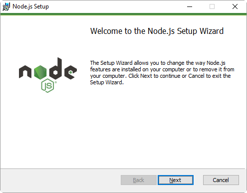
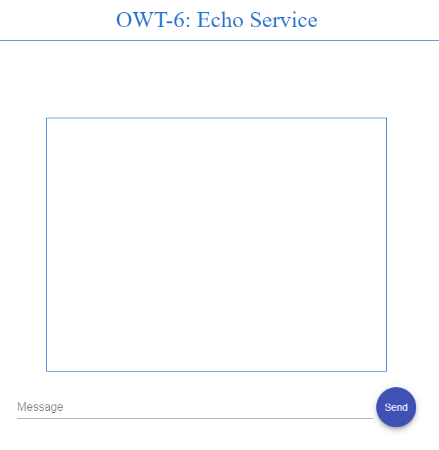
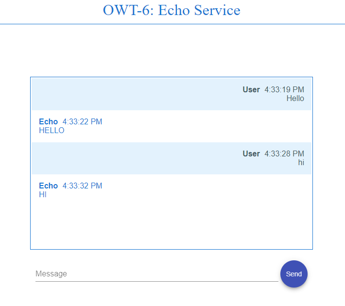

# OWT-6: Deploying an Angular Web Application in Karaf


Table of Contents
=================
 * [1\. General Notes](#1-general-notes)
      * [Cleaning Karaf](#cleaning-karaf)
  * [2\. Maven Module: bundle\-parent](#2-maven-module-bundle-parent)
  * [3\. Maven Module: bundle\-lib](#3-maven-module-bundle-lib)
  * [4\. Maven Module: bundle\-api](#4-maven-module-bundle-api)
  * [5\. Maven Module: bundle\-impl](#5-maven-module-bundle-impl)
  * [6\. Maven Module: bundle\-rest](#6-maven-module-bundle-rest)
    * [The WADL](#the-wadl)
  * [7\. Maven Module: bundle\-ui](#7-maven-module-bundle-ui)
    * [Web Technology Used](#web-technology-used)
    * [Angular](#angular)
    * [Material Design](#material-design)
  * [Creating an Angular Web application](#creating-an-angular-web-application)
      * [Python Installation](#python-installation)
      * [Node\.js and NPM Installation (Windows)](#nodejs-and-npm-installation-windows)
      * [NPM](#npm)
    * [Angular Application Structure](#angular-application-structure)
      * [Angular modules](#angular-modules)
      * [Bootstrapping in main\.ts](#bootstrapping-in-maints)
      * [The Root AppModule](#the-root-appmodule)
      * [The NgModule](#the-ngmodule)
    * [UI Layout &amp; Styling](#ui-layout--styling)
      * [Angular CDK](#angular-cdk)
      * [Angular Material](#angular-material)
      * [Animations Package](#animations-package)
      * [Theming](#theming)
      * [Gestures: HammerJS](#gestures-hammerjs)
    * [Basic Layout Elements](#basic-layout-elements)
      * [The Header](#the-header)
      * [The Message Box](#the-message-box)
    * [Business Logic](#business-logic)
      * [Element References](#element-references)
      * [Data Binding](#data-binding)
    * [REST Service Client](#rest-service-client)
      * [HTTP Headers](#http-headers)
      * [Calling the REST Endpoint](#calling-the-rest-endpoint)
      * [Call the Angular Service](#call-the-angular-service)
    * [Apache Karaf WebContainer and Angular](#apache-karaf-webcontainer-and-angular)
      * [The frontend\-maven\-plugin](#the-frontend-maven-plugin)
  * [8\. Installing the Bundles on Karaf](#8-installing-the-bundles-on-karaf)
      * [Installing dependencies](#installing-dependencies)
    * [Installing: bundle\-lib](#installing-bundle-lib)
    * [Installing: bundle\-api](#installing-bundle-api)
    * [Installing: bundle\-impl](#installing-bundle-impl)
    * [Installing: bundle\-rest](#installing-bundle-rest)
    * [Installing: bundle\-ui](#installing-bundle-ui)
  * [9\. The Application in Action](#9-the-application-in-action)

## 1. General Notes
This tutorial is an introduction on how to create and deploy an Angular web application in Karaf.
It is a modified version of OWT-5, in which the user interface is developed using Angular and Angular Material, instead of jQuery.

This tutorial will demonstrate the following:
1. A single-page web application built in Angular.
2. A client service that will consume REST services - like the ones defined in OWT-5 - by using Angular.


>The code for this tutorial is available in the `code` directory. It is recommended to have it checked-out locally and refer to it while going through the tutorial.  
>All the maven modules detailed below have the standard maven directory structure.  
>The code of this tutorial builds on the base provided by OWT-5. As a result, only new concepts/features will be explained here.


> #### Cleaning Karaf
> In order to avoid dependency conflicts and other configuration errors, we will make sure that Karaf is clean and unnecessary bundles are removed. _(Please note that this is not mandatory, but it is considered a good practice)_.
>
> This is achieved by starting Karaf the following way (for Windows):
> ```
> karaf.bat clean
> ```

## 2. Maven Module: bundle-parent
As in previous OWT tutorials, the `bundle-parent` maven module serves as the _parent_ maven project for building the application/service.

## 3. Maven Module: bundle-lib
Library bundle. No changes from OWT-5.

## 4. Maven Module: bundle-api
The Services container bundle. No changes from OWT-5.

 ## 5. Maven Module: bundle-impl
The Service implementation module. No changes from OWT-5.

 ## 6. Maven Module: bundle-rest

This bundle hosts the REST service. No changes from OWT-5.

### The WADL
Below is the echo service WADL, same as OWT-5:

 

## 7. Maven Module: bundle-ui
The `bundle-ui` is an module containing the Angular web content, and the configuration required in order to deploy itself as an Angular web application. 

### Web Technology Used
In order to create the user interface for the application of this tutorial, the following technologies were used.

> ### Angular
> Angular - commonly referred to as "Angular 2+" or "Angular 2" - is a TypeScript-based open-source front-end web application platform 
> led by the Angular Team at Google and by a community of individuals and corporations to address all of the parts of the 
> developer's workflow while building complex web applications. Angular is a complete rewrite from the same team that built AngularJS.

> ### Material Design
> Material Design (codenamed Quantum Paper) is a design language developed in 2014 by Google. Expanding upon the "card" motifs that debuted in Google Now, Material Design makes more liberal use of grid-based layouts, responsive animations and transitions, padding, and depth effects such as lighting and shadows.

## Creating an Angular Web application
In order to create an Angular web application the following prerequisites must be satisfied.

#### Python Installation
Python 2.7.X (latest) should be downloaded from [python.org/downloads](https://www.python.org/downloads/), and installed.
 > Note: This tutorial uses Python 2.7.2.

 

#### Node.js and NPM Installation (Windows)
- Download the Windows installer from the Nodes.js [web site](https://nodejs.org/en/)
- Run the installer (the .msi file downloaded in the previous step.)
- Follow the prompts in the installer (Accept the license agreement, and accept the default installation settings).

 

> #### NPM
>
> NPM stands for Node Package Manager. It's an online repository of node packages that can be quickly and programmatically installed from the command line, with the `npm` command line interface that comes with Node.


### Angular Application Structure
The Angular-related code resides in the _code/bundle-ui/angular_ directory. Inside that, the following items can be found. It is important to note that some of the source files displayed below are automatically generated by the angular cli too, and not by the developers themselves.

```shell
# App source code and configuration
├── src
│   ├── app                         # App source code base directory
│   │   ├── app.component.html
│   │   ├── app.component.scss
│   │   ├── app.component.spec.ts
│   │   ├── app.component.ts
│   │   └── app.module.ts
│   ├── assets                      # Static files like images, etc
│   ├── environments                # Configuration for different deployments (e.g. production, development, etc.)
│   │   ├── environment.prod.ts
│   │   └── environment.ts
│   ├── favicon.ico                 # Application icon
│   ├── index.html                  # The main HTML page
│   ├── main.ts                     # Application mein entry point
│   ├── polyfills.ts
│   ├── service                     # Services are usually kept seperately from view-related files
│   │   └── service.ts
│   ├── styles.scss                 # Global styles for the application
│   ├── test.ts
│   ├── tsconfig.app.json           # TypeScript compiler configuration
│   ├── tsconfig.spec.json          # TypeScript compiler configuration
│   └── typings.d.ts                # SystemJS module definition

# Testing
├── e2e                             # End-to-end tests
│   ├── app.e2e-spec.ts
│   ├── app.po.ts
│   └── tsconfig.e2e.json
├── karma.conf.js                   # Karma test runner configuration
├── protractor.conf.js              # Protractor e2e tests configuration

# Dependencies
├── package.json                    # Declared application dependencies
├── package-lock.json               # Resolved application dependencies

# Miscellaneous
├── README.md                       # Project README file

# TypeScript configuration
├── tsconfig.json                   # TypeScript compiler configuration
└── tslint.json                     # TypeScript lint configuration

```


> #### Angular modules
> Modules are a great way to organize an application and extend it with capabilities from external libraries.
> Many Angular libraries are modules (such as FormsModule, HttpModule, and RouterModule). Many third-party libraries are available as 
> NgModules (such as Material Design, Ionic, AngularFire2).

> #### Bootstrapping in main.ts
> The main entry point `main.ts` compiles the application with the JIT compiler and bootstraps the application's root module to run in the browser:
> ```ts
> platformBrowserDynamic().bootstrapModule(AppModule);
> ```


> #### The Root AppModule
> Every Angular app has a root module class. By convention, the root module class is called `AppModule` and it exists in a file named `app.module.ts`.
>
> ```ts
> import { NgModule }      from '@angular/core';
> import { BrowserModule } from '@angular/platform-browser';
> import { AppComponent }  from './app.component';
> 
> @NgModule({
>   imports:      [ BrowserModule, ... ],
>   declarations: [ AppComponent ],
>   bootstrap:    [ AppComponent ]
> })
> export class AppModule { }
> ```

> #### The NgModule
>
> An `NgModule` is a class adorned with the `@NgModule` decorator function. @NgModule takes a metadata object that tells Angular how 
> to compile and run module code. It identifies the module's own components, directives, and pipes, making some of them public so 
> external components can use them. @NgModule may add service providers to the application dependency injectors.

The following table summarizes the NgModule metadata properties:

Property|Description
---|--------
declarations|A list of declarable classes, the component, directive, and pipe classes that belong to this module.These declared classes are visible within the module but invisible to components in a different module.
providers| A list of dependency-injection providers.
imports | A list of supporting modules.
exports| A list of declarations—component, directive, and pipe classes—that an importing module can use.
bootstrap| A list of components that can be bootstrapped.
entryComponents| A list of components that are not referenced in a reachable component template.


### UI Layout & Styling

The user interface components are laid-out and styled in the `app.component.html` and `style.css` files. For Better look and feel we will use `Angular Material` along with `Angular Animations`, decorated with one of Angular's official css theme. The following libraries were used to create the user interface:


> #### Angular CDK
>
> Angular CDK is a standalone package, whose goal is to give developers specific tools to create components for the web. Angular CDK is the acronym of `Angular component dev kit`. This signifies that Angular CDK are general-purpose tools for building components that are not coupled to Material Design.


> #### Angular Material
>
>  Material Design components are pre-built UI components, created for and with Angular.

> #### Animations Package
>
>  Some `Angular Material` components depend on the `Angular Animations` module in order to be able to do more advanced transitions. To enable these animations in the application, this module needs to be included.


> #### Theming
> Including a theme allows to easily apply existing styles and decorations. From then on, it is easy to extend and customize the original theme. In `styles.scss`:
>
> ```scss
> @import '~@angular/material/prebuilt-themes/indigo-pink.css';
> ```

> #### Gestures: HammerJS
> Some components rely on library `HammerJS` for gestures. In order to get the full feature-set of these components, HammerJS must be included into the application


### Basic Layout Elements
The _src/app/app.component.html_ file contains the basic layout of the Angular application. the following elements are worth noting:

> #### The Header
> Almost every application contains a header of some sort. In this case, the header is styled in the `styles.scss` file.
> 
> ```html
> <div id="header">OWT-6: Echo Service</div>
>```

> #### The Message Box
> In order to create the message-box, an `md-nav-list` component is used. Inside it, a scroll-frame is placed.  
> Inside that, `md-list-item`(s) are created by the sent and received messages.  
> A check is performed to determine it the message is originating from the user, or the echo service, and it is then styled accordingly.
> 
> ```html
> <md-nav-list flex>
>   <div #scrollme class="owt-list">
>   
>   <md-list-item *ngFor="let message of messages; let i = index">
>   
>       <div *ngIf="message.from=='user'" class="user-message">
>           <div class="title-line">
>               <div class="name">User</div>
>               <div class="when">{{message.when}}</div>
>           </div>
>           <div class="message-line">{{message.text}}</div>
>       </div>
>   
>       <div *ngIf="message.from=='echo'" class="echo-message">
>           <div class="title-line">
>               <div class="name">Echo</div>
>               <div class="when">{{message.when}}</div>
>           </div>
>           <div class="message-line">{{message.text}}</div>
>       </div>
>       
>   </md-list-item>
>   </div>
> </md-nav-list>
>```

### Business Logic
The Angular/Typescript code consists of a few methods in the `app.component.ts` file. The following are the points of interest.

> #### Element References
> In order to reference UI elements from the TypeScript code, references to them can be created using the `@ViewChild` annotation
> ```ts
> @ViewChild('scrollme') private myScrollContainer: ElementRef;
> @ViewChild('messageBox') private messageBox: HTMLInputElement;
> ```

> #### Data Binding
> It is possible to directly access and modify an `ngModel` variable from Typescript. This binding allows developers to effortlessly update the UI by simply updating the data model.
> 
> ```ts
> private textBoxMessage: String;
> ```
> 
> ```html
> <input #messageBox mdInput [(ngModel)]="textBoxMessage" placeholder="Message" size="50%" (keyup.enter)="printData()" value="">
> ```

### REST Service Client
The _service/service.ts_ file is where all the interaction with the backend is tacking place.

> #### HTTP Headers
> In order to communicate with the REST service, `application/json` content type has to be declared in the request's header. This is done in the following way.
> 
> ```ts
> constructor(private http: Http) {
>   this.headers = new Headers({ 'Content-Type': 'application/json', 
>                                 'Accept': 'application/json' });
>   this.options = new RequestOptions({ headers: this.headers });
> }
> ```

> #### Calling the REST Endpoint
> The code below performs an `HTTP POST` request to the endpoint, and sends the strinigied version of the passed object.  
> This service returns a `promise` which will call the `extractData` method to fetch the actual REST payload.  
> If an error occurs, the `handleError` will log it into the console.
> 
>  ```ts
> create(url: string, param: any): Promise<any> {
>   let body = JSON.stringify(param);
>   return this.http
>       .post(url, body, this.options)
>       .toPromise()
>       .then(this.extractData)
>       .catch(this.handleError);
> }  
> 
> private extractData(res: Response) {
>   let body = res.json();
>   return body || {};
> }
> 
> private handleError(error: any): Promise<any> {
>   console.error('An error occurred', error);
>   return Promise.reject(error.message || error);
> }
> ```

> #### Call the Angular Service
> The service expained above can be called as shown below. This snippet will call the `addMessageTologQueue` method with the message contained in the response received from the HTTP POST request.
> 
> ```ts
> this.messageService.create(this.SERVICE_URL, messageObject).then((result) => {
>   this.addMessageTologQueue(result.message, true);
> })
> ```


### Apache Karaf WebContainer and Angular

Up to now we have created a simple but complete Angular app. The next step is to add that app to karaf.
To do so, we will need the Karaf war feature but also the `frontend-maven-plugin`.

> #### The frontend-maven-plugin
> This maven plugin downloads and installs `Node` and `NPM` locally in the project directory, installs any dependencies it is instructed to, and then builds the project.
> 
> ```xml
> <plugin>
>     <groupId>com.github.eirslett</groupId>
>     <artifactId>frontend-maven-plugin</artifactId>
>     <version>1.0</version>
>     <configuration>
>         <workingDirectory>angular</workingDirectory>
>         <installDirectory>temp</installDirectory>
> </configuration>
> ```
> 
> Within the `plugin` we can add the list of desired executions. Here is the caode that installs the `animations` package:
> ```xml
> <!-- It will install animations -->
> <execution>
>     <id>npm install animations</id>
>     <goals>
>         <goal>npm</goal>
>     </goals>
>     <configuration>
>         <arguments>install --save @angular/animations</arguments>
>         <skip>${skip.npm.deps}</skip>
>     </configuration>
> </execution>
> ```

It is important to note that the `frontend-maven-plugin` is set to install all the nessesary dependencies, but these need to be installed only once. In order to speed-up subsequent re-builds, the `-Dskip.npm.deps=true` parameter can be passed to the maven build in order to skip their re-installation:

```shell
mvn clean install -Dskip.npm.deps=true
```

## 8. Installing the Bundles on Karaf
Before installing the bundles themselves, Karaf must me prepared as described below:

#### Installing dependencies

As in OWT-4, since Karaf was cleaned of deployments, all the necessary dependencies must be re-installed:

Apache CXF repository:
```
repo-add cxf 3.1.8
```

After repository CXF features can be installed: `cxf-jaxrs` and `cxf-jackson`
```
feature:install cxf-jaxrs cxf-jackson
```

Install dependency-injection:
```
feature:install pax-cdi
install -s wrap:mvn:javax.inject/javax.inject/1
```

As mentioned [before](#apache-karaf-webcontainer), to deploy web based modules, we need to setup `Apache Karaf WebContainer` by installing the plugin `war feature`:

```
feature:install war
```


### Installing: bundle-lib
Execute the following on the Karaf command-line:
```
bundle:install -s mvn:com.owt6.demo/bundle-lib/1.0.0-SNAPSHOT
```

### Installing: bundle-api
Execute the following on the Karaf command-line:
```
bundle:install -s mvn:com.owt6.demo/bundle-api/1.0.0-SNAPSHOT
```

### Installing: bundle-impl
Execute the following on the Karaf command-line:
```
bundle:install -s mvn:com.owt6.demo/bundle-impl/1.0.0-SNAPSHOT
```

### Installing: bundle-rest
Execute the following on the Karaf command-line:
```
bundle:install -s mvn:com.owt6.demo/bundle-rest/1.0.0-SNAPSHOT
```

### Installing: bundle-ui
Execute the following on the Karaf command-line:
```
bundle:install -s mvn:com.owt6.demo/bundle-ui/1.0.0-SNAPSHOT
```

## 9. The Application in Action
The deployed web page can be accessed at http://localhost:8181




Using the `Echo` service:


