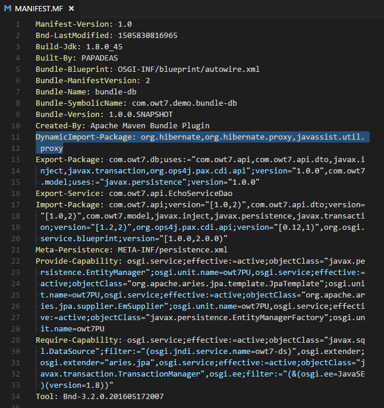
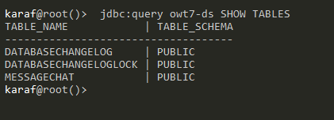
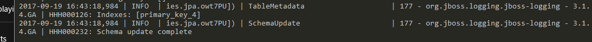
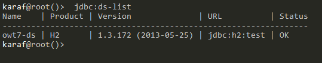
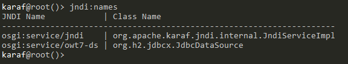
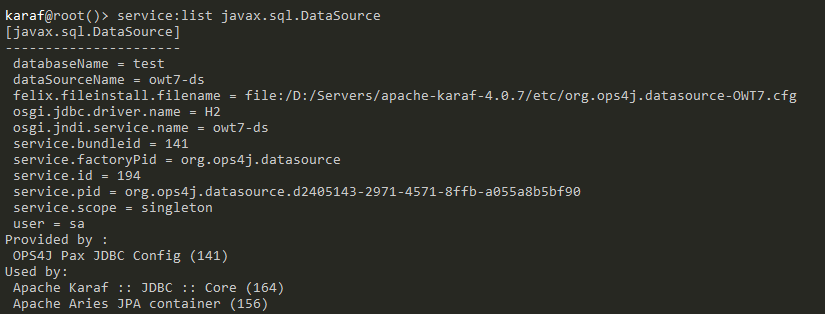
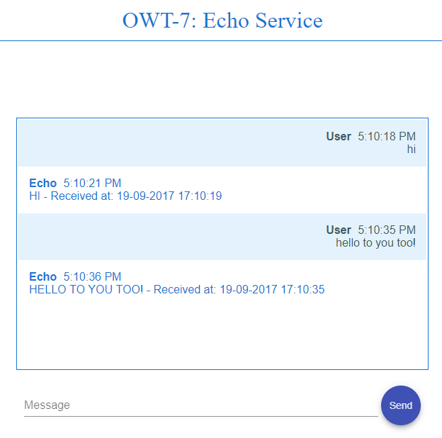
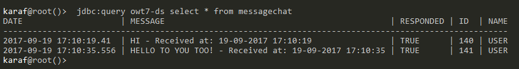

## OWT-7: Database Communication in Karaf via Services

Table of Contents
=================
 * [1\. General Notes](#1-general-notes)
      * [Cleaning Karaf](#cleaning-karaf)
  * [2\. Maven Module: bundle\-parent](#2-maven-module-bundle-parent)
  * [3\. Maven Module: bundle\-lib](#3-maven-module-bundle-lib)
  * [4\. Maven Module: bundle\-api](#4-maven-module-bundle-api)
      * [EchoDatabaseService Methods](#echodatabaseservice-methods)
  * [5\. Maven Module: bundle\-impl](#5-maven-module-bundle-impl)
    * [Connecting the services](#connecting-the-services)
      * [Injecting EchoDatabaseService](#injecting-echodatabaseservice)
  * [6\. Maven Module: bundle\-rest](#6-maven-module-bundle-rest)
  * [7\. Maven Module: bundle\-ui](#7-maven-module-bundle-ui)
  * [8\. Maven Module: bundle\-db](#8-maven-module-bundle-db)
      * [Hibernate ORM](#hibernate-orm)
      * [Persistence\-specific instructions](#persistence-speci%EF%AC%81c-instructions)
      * [Auto\-Populating the Manifest file](#auto-populating-the-manifest-file)
      * [The persistence\.xml file](#the-persistencexml-file)
    * [ORM Entities](#orm-entities)
      * [Entity Definition](#entity-definition)
    * [EchoServiceDao: Transactions](#echoservicedao-transactions)
      * [EchoServiceDao: PersistenceContext and EntityManager](#echoservicedao-persistencecontext-and-entitymanager)
      * [The Manifest](#the-manifest)
    * [Installing the Bundles on Karaf](#installing-the-bundles-on-karaf)
      * [Installing dependencies](#installing-dependencies)
      * [Installing Database Interaction Dependencies](#installing-database-interaction-dependencies)
      * [Apache Aries](#apache-aries)
    * [Installing: bundle\-lib](#installing-bundle-lib)
    * [Installing: bundle\-api](#installing-bundle-api)
    * [Installing: bundle\-impl](#installing-bundle-impl)
    * [Installing: bundle\-rest](#installing-bundle-rest)
    * [Installing: bundle\-ui](#installing-bundle-ui)
    * [Installing: bundle\-db](#installing-bundle-db)
      * [Verify Database communication](#verify-database-communication)
      * [Configure The Datasource](#configure-the-datasource)
      * [JDBC Registration test](#jdbc-registration-test)
      * [JNDI Registration Test](#jndi-registration-test)
      * [Jdbc Test Query](#jdbc-test-query)
      * [DataSource is a service](#datasource-is-a-service)


## 1. General Notes

The purpose of this tutorial is to showcase database communication in an OSGi service. In particular it will:
1. Enhance the service(s) used in OWT-6, and integrate `Hibernate ORM` technology into them.
2. Store and read data from an underlying database.

> The code for this tutorial is available in the `code` directory. It is recommended to have it checked-out locally and refer to it while going through the tutorial.
> All the maven modules detailed below have the standard maven directory structure.
> The code of this tutorial builds on the base provided by OWT-6. As a result, only new concepts/features will be explained here.


> #### Cleaning Karaf
> In order to avoid dependency conflicts and other configuration errors, we will make sure that Karaf is clean and unnecessary bundles are removed. _(Please note that this is not mandatory, but it is considered a good practice)_.
>
> This is achieved by starting Karaf the following way (for Windows):
> ```
> karaf.bat clean
> ```


## 2. Maven Module: bundle-parent
As in previous OWT tutorials, the `bundle-parent` maven module serves as the _parent_ maven project for building the application/service.

## 3. Maven Module: bundle-lib
Library bundle. No changes from OWT-5.


## 4. Maven Module: bundle-api
The Services container bundle. A new service specification has been added. The `EchoDatabaseService` which will handle the data communication with the database layer .

> #### EchoDatabaseService Methods
> The `create` method inserts a row in the database containing message information.
> The `get` method retrieves that line.
> The `update` method will update the data of an existing entry.
>
> ```java
>     Integer create(MessageDTO messageDTO);
>     MessageDTO get(Integer id);
>     void update(Integer id);
> ```


 ## 5. Maven Module: bundle-impl
The Service implementation module.

### Connecting the services
The implementation of EchoService must communicate with the database bundle via a new OSGi service EchoDatabaseService which will handle that interaction.
To be able to call the new OSGi service, it must be injected properly:

> #### Injecting EchoDatabaseService
> The `@Inject` annotation will pass an instance (or _the_ instance, if referring to a singleton) of the referenced object.
> The `@OsgiService` annotation specifies that it is an OSGi Service that is injected.
>
> ```java
>     ...
>     @Inject
>     @OsgiService
>     private EchoDatabaseService EchoDatabaseService;
>     ...
> ```

 ## 6. Maven Module: bundle-rest

This bundle hosts the REST service. No changes from OWT-6.

## 7. Maven Module: bundle-ui

This bundle hosts the Angular web application. No changes from OWT-6.


## 8. Maven Module: bundle-db
This bundle contains all the database-related components. It contains the `persistence.xml` file, along with the following three packages:

- _com.owt7.db_ package: The `Data Access Object (DAO)` class, used to interact with the database
- _com.owt7.model_ package: The `ORM Entity` objects, analogous to database tables.
- _com.owt7.service_ package: The implementation(s) of the `EchoDatabaseService` service.

> #### Hibernate ORM
> Hibernate ORM (Hibernate in short) is an Object-Relational Mapping tool for the Java programming language. It provides a framework for mapping an object-oriented domain model to a relational database. Hibernate handles object-relational impedance mismatch problems by replacing direct, persistent database accesses with high-level object handling functions.

>#### Persistence-specific instructions
>A persistence bundle is an OSGi bundle that contains one or more persistence descriptors (persistence.xml files), and has a Meta-Persistence
>header in the bundle manifest, `META-INF/MANIFEST.MF`. This header lists all the locations of persistence.xml files in the persistence bundle.
>When this header is present, the default location, `META-INF/persistence.xml`, is added by default. Therefore, when the persistence.xml files
>are in the default location, the Meta-Persistence header must be present, but its content can be empty (a single space). The example of a
> Meta-Persistence header below, defines a persistence bundle in entities.
>
> Any persistence.xml files that are in the default location can also be used. In OSGi, `DynamicImport-Package` attribute is used in the MANIFEST.MF
> file to specify the patterns of packages that are not found in the normal bundle contents or Import-Package field. If the package is not available
> in the initial resolution process, it will not fail, but the container will attempt to resolve the dependency again, every time a class from the package is required.
> In this case, the `hibernate` and `javassist` packages are included.
>

> #### Auto-Populating the Manifest file
> In order avoid entering the mandatory entries to the `MANIFEST.MF` file manually , the `org.apache.felix maven-bundle-plugin` can be used for declaring these entries at pom.xml:
>
>```xml
>...
><Meta-Persistence>META-INF/persistence.xml</Meta-Persistence>
><DynamicImport-Package>org.hibernate,org.hibernate.proxy,javassist.util.proxy</DynamicImport-Package>
>...
>```


>#### The persistence.xml file
>
> The persistence.xml file is contains the JPA configuration of the bundle. 
> The `name` attribute must be unique, as discussed. The `transaction-type` defines the way transactions are handled.
> The `datasource` is a `JDBC` URL of the datasource that must be configured within Karaf. 
> The `class` entry(ies) declare the `ORM Entity` classes that will be used by the persistence unit.
> The `properties` tag allows to define specific instructions to the JPA provider, `Hibernate` in this case. 
> The `hibernate.hbm2ddl.auto/update` name/value pair in this example, tells Hibernate to update the target database structure to what is defined
> within the application sources, every time the persistence unit is reconnected to the DB.
>
>```xml
>   <persistence-unit name="owt7PU" transaction-type="JTA">
>     <!-- The jta-data-source points to the JNDI name of the database this persistence unit maps to. -->
>        <jta-data-source>osgi:service/javax.sql.DataSource/(osgi.jndi.service.name=owt7-ds)</jta-data-source>
>         <!-- declare the list of entities here: -->
>        <class>com.owt7.model.MessageChat</class>
>       <!-- auto-create the database schema -->
>        <properties>
>            <property name="hibernate.hbm2ddl.auto" value="update" />
>        </properties>
>    </persistence-unit>
>```


### ORM Entities

An entity is a lightweight persistence domain object. Typically, an entity represents a table in a relational database, and each entity
instance corresponds to a row in that table. The primary programming artifact of an entity is the entity class, although entities can use
helper classes. The persistent state of an entity is represented either through persistent fields or persistent properties. These fields or
properties use object/relational mapping annotations to map the entities and entity relationships to the relational data in the underlying
data store.

>#### Entity Definition
>
>The `@Id` annotation marks a field as a primary key field.
>
>The `@GeneratedValue` annotation may be applied to a primary key property or field of an entity or mapped superclass in conjunction
with the Id annotation. The use of the GeneratedValue annotation is only required to be supported for simple primary keys. Use of
the GeneratedValue annotation is not supported for derived primary keys.
> - `strategy` _(Optional)_: The primary key generation strategy that the persistence provider must use to generate the annotated
>entity primary key.
> - `generator` _(Optional)_: The name of the primary generator to use as specified in the SequenceGenerator or TableGenerator.
>
>
>The `@SequenceGenerator` annotation defines a primary key generator that may be referenced by name when a generator element is
>specified for the GeneratedValue annotation.A sequence generator may be specified on the entity class or on the primary key field
>or property.
>@SequenceGenerator arguments:
>- `name` _(Required)_: A unique generator name that can be referenced by one or more classes to be the generator for primary key values.
>- `sequenceName` _(Optional)_: The name of the database sequence object from which to obtain primary key values.
>- `initialValue` _(Optional)_: The value from which the sequence object is to start generating.
>- `allocationSize` _(Optional)_: The amount to increment by when allocating sequence numbers from the sequence.
>
>
>```java
>@Entity
>public class MessageChat {
>    @Id
>    @GeneratedValue(strategy=GenerationType.SEQUENCE, generator="ids_gen")
>    @SequenceGenerator(
>            name="ids_gen",
>            sequenceName="ids_sequence",
>            allocationSize=20
>        )
>    private Integer id;
>    ...
>```

>
>### EchoServiceDao: Transactions
>
>The `@Transactional` (javax.transaction.Transactional) annotation provides the application the ability to declaratively control
>transaction boundaries on CDI managed beans, as well as classes defined as managed beans by the Java EE specification, at both the
>class and method level where method level annotations override those at the class level.
>
>```java
>
> @Singleton
> public class EchoServiceDao  {
>
> @Transactional
> public Integer create(MessageDTO messageDTO) {
>    ...
>```

>
>#### EchoServiceDao: PersistenceContext and EntityManager
>The `EntityManager` itself is created by the container using the information in the persistence.xml, so to use it at runtime, we
>simply need to request it be injected into one of our components. We do this via @PersistenceContext. The `@PersistenceContext`
>annotation can be used on any CDI bean, Servlet, Servlet Listener, Servlet Filter, or JSF ManagedBean. Also note that a transaction
>is required for any of the create, update or delete methods of the EntityManager to work.
>
>Example usage of EntityManager at the EchoServiceDao:
>```java
>   // EntityManager declaration:
>   @PersistenceContext(unitName = "owt7PU")
>   private EntityManager em;
> 
>   //EntityManager storing the messageChat entity:
>   em.persist(messageChat);
>   ...
>```
>
>

#### The Manifest
The Manifest of bundle-db:


 


### Installing the Bundles on Karaf
Before installing the bundles themselves, Karaf must me prepared as described below:

#### Installing dependencies


As in OWT-6, since Karaf was cleaned of deployments, all the necessary dependencies must be re-installed:

Apache CXF repository:
```
repo-add cxf 3.1.8
```

After repository CXF features can be installed: `cxf-jaxrs` and `cxf-jackson`
```
feature:install cxf-jaxrs cxf-jackson
```

Install dependency-injection:
```
feature:install pax-cdi
install -s wrap:mvn:javax.inject/javax.inject/1
```

Install `war feature`: to deploy web based modules:

```
feature:install war
```

#### Installing Database Interaction Dependencies


####  Apache Aries
 The Aries project will deliver a set of pluggable Java components enabling an enterprise OSGi application programming model. This includes implementations and extensions of application focused specifications defined by the OSGi Alliance Enterprise Expert Group (EEG) and an assembly format for multi-bundle applications, for deployment to a variety of OSGi based runtimes.


 Enable the database related features :

   `feature:install jpa transaction jndi jdbc pax-jdbc pax-jdbc-pool-dbcp2 pax-jdbc-config hibernate `

Install the database handler:

feature:install pax-jdbc-h2

> In this tutorial we use h2-DB.


### Installing: bundle-lib
Execute the following on the Karaf command-line:
```
bundle:install -s mvn:com.owt7.demo/bundle-lib/1.0.0-SNAPSHOT
```

### Installing: bundle-api
Execute the following on the Karaf command-line:
```
bundle:install -s mvn:com.owt7.demo/bundle-api/1.0.0-SNAPSHOT
```

### Installing: bundle-impl
Execute the following on the Karaf command-line:
```
bundle:install -s mvn:com.owt7.demo/bundle-impl/1.0.0-SNAPSHOT
```

### Installing: bundle-rest
Execute the following on the Karaf command-line:
```
bundle:install -s mvn:com.owt7.demo/bundle-rest/1.0.0-SNAPSHOT
```

### Installing: bundle-ui
Execute the following on the Karaf command-line:
```
bundle:install -s mvn:com.owt7.demo/bundle-ui/1.0.0-SNAPSHOT
```

### Installing: bundle-db


Execute the following on the Karaf command-line:
```
bundle:install -s mvn:com.owt7.demo/bundle-db/1.0.0-SNAPSHOT
```


#### Verify Database communication

View all tables of the datasource:

 jdbc:query owt7-ds SHOW TABLES

 


####  Configure The Datasource
 
To configure the datasource `owt7-ds` via  Karaf cmd enter the following lines:
The name `owt7-ds` has been already declared at `persistence.xml`

```
config:edit org.ops4j.datasource-OWT7;
config:property-set osgi.jdbc.driver.name H2;
config:property-set databaseName test;
config:property-set user sa;
config:property-set dataSourceName owt7-ds;
config:update

```
Wait process to finish at log :




#### JDBC Registration test
To list all the JDBC datasources installed in Karaf:

```
     jdbc:ds-list
```

 


#### JNDI Registration Test

Since bundle uses jpa, what is actually does is a jndi-lookup. To view registered jndi-lookups in Karaf cmd:

```
 jndi:names
 ```

 


#### Jdbc Test Query

```
jdbc:query owt7-ds select 1
```


After installation:

#### DataSource is a service

To list all the services that implement javax.sql.DataSource

    service:list javax.sql.DataSource

This service was autogenerated by pax-jdbc config

 

Where the datasource name also exists:
`osgi.jndi.service.name = owt7-ds`


Calling the EchoService at http://localhost:8181/:
 

 Execute query toe H2-DB by: `jdbc:query owt7-ds select * from messagechat`

 


